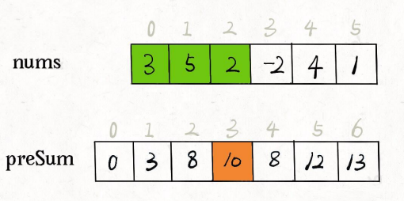

# 前缀和

前缀和技巧适⽤于快速、频繁地计算⼀个索引区间内的元素之和。

本⽂有labuladong的b站视频：[前缀和/差分数组技巧精讲](https://www.bilibili.com/video/BV1NY4y1J7xQ/)

对应题目：

|                             力扣                             | 难度 |
| :----------------------------------------------------------: | :--: |
| [303. 区域和检索 - 数组不可变 - 力扣（LeetCode）](https://leetcode.cn/problems/range-sum-query-immutable/description/) |  🟢   |
| [304. 二维区域和检索 - 矩阵不可变 - 力扣（LeetCode）](https://leetcode.cn/problems/range-sum-query-2d-immutable/description/) |  🟠   |
| [560. 和为 K 的子数组](https://leetcode.cn/problems/subarray-sum-equals-k/) |  🟠   |
| [LCR 013. 二维区域和检索 - 矩阵不可变 - 力扣（LeetCode）](https://leetcode.cn/problems/O4NDxx/description/) |  🟠   |

算法框架：

```java
//	三部曲：
//	1. 构建前缀和数组，preSum[0] = 0，便于计算累加和
//	2. 计算 nums 的累加和，即填充preSum数组
//	3. 实现具体算法功能 （有些功能写在步骤2中好实现）
```

例一：[303. 区域和检索 - 数组不可变 - 力扣（LeetCode）](https://leetcode.cn/problems/range-sum-query-immutable/description/)

```java
class NumArray {
    public int subarraySum(int[] nums, int k) {
        // 构建前缀和数组，preSum[0] = 0，便于计算累加和
        int[] preSum = new int[nums.length + 1];
        // 计算 nums 的累加和
        for (int i = 1; i < preSum.length; i++) {
            preSum[i] = preSum[i - 1] + nums[i - 1];
        }
        // 实现具体算法功能 
        /* 查询闭区间 [left, right] 的累加和 */
        preSum[right + 1] - preSum[left];
    }
```

看这个 preSum 数组，如果我想求索引区间 [1, 4] 内的所有元素之和，就可以通过 preSum[5] - preSum[1] 得出，因此用preSum[right+1]-preSum[left]求闭区间 [left, right] 的累加和。




例二：[560. 和为 K 的子数组](https://leetcode.cn/problems/subarray-sum-equals-k/)

```java
class Solution {
    public int subarraySum(int[] nums, int k) {
        int cnt = 0, pre = 0;
        // 构建前缀和数组，preSum[0] = 0，便于计算累加和
        HashMap<Integer, Integer> mp = new HashMap<>();
        mp.put(0,1);
        
        // 计算 nums 的累加和
        for(int i=0; i<nums.length; i++){
            pre += nums[i];
            if(mp.containsKey(pre-k)){
                cnt += mp.get(pre-k);
            }
            mp.put(pre,mp.getOrDefault(pre,0) +1 );
        }
        return cnt;
  	}
}
```


