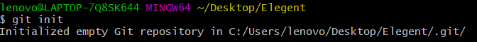
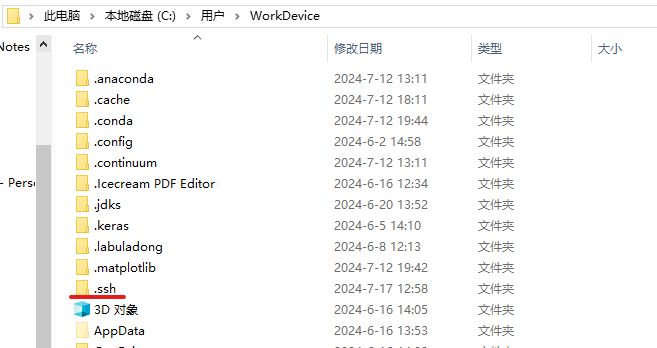
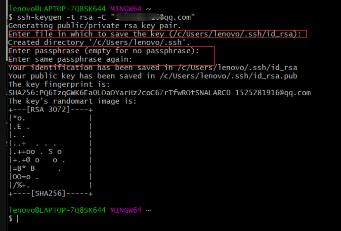
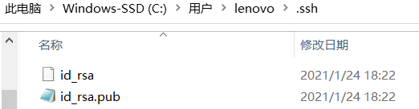
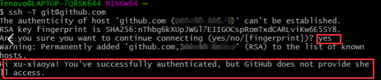
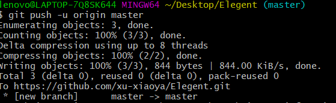

# GitNotes

来自：[Github——git本地仓库建立与远程连接-CSDN博客](https://blog.csdn.net/qq_29493173/article/details/113094143)

## 一、git简介

Git是一个开源的分布式版本控制系统，可以有效、高速的处理从很小到非常大的项目版本管理。

## 二、git下载

2.1下载地址
		Git客户端官网下载链接：https://git-scm.com/downloads
		选择适合自己本机的版本下载。

## 三、git安装

### 3.1安装

​	双击“Git-2.17.0-64-bit.exe”，进入安装导向界面，点击Next>直至install，安装完成。

### 3.2 配置

​			计算机右键-属性：为方便后续应用和验证是否安装成功，配置环境变量配置path(本步骤可不做)

​	cmd输入“git --version”，出现版本信息即安装成功。

### 3.3config设置（增删改查）

设置username 和 email

```bash
$ git config --global user.name  "name"//自定义用户名
```

```bash
$ git config --global user.email "youxiang@qq.com"//用户邮箱
```


修改

```bash
git config --global configname configvalue
```

查询

```bash
git config --global configname
```

查询全部

```bash
git config --list
```


## 四.github与git连接——本地Git仓库

### 4.1 建本地的版本库

等同于新建一个空文件夹，或者进入想要git上传的文件夹

进入，右键-Git Bash-输入“git init”初始化成一个Git可管理的仓库



这时文件夹里多了个.git文件夹，**它是Git用来跟踪和管理版本库的**。


如果你看不到，需要设置一下让隐藏文件可见。 


### 4.2 上传到本地仓库

```bash
git status：查看当前的状态
```

- 红字表示未add到Git仓库上的文件

- 绿字表示已add到Git仓库上的文件

然后通过**git add**把项目/源代码添加到仓库

```bash
git add . //把该目录下的所有文件添加到仓库，注意点“.”
git add "file name"
```

可以看到，查询状态后文件已经变为绿色，说明add成功

### 4.3提交仓库

用git commit把项目提交到仓库。"-m"后面引号里面是本次提交的注释内容，可以不写，但最好写上，不然会报错

```bash
$ git commit -m "240717-01-fileName" //"date-nums-fileName"
```

```bash
git log //查看所有commit提交记录
```


## 五、github与git的连接——远程连接

本地Git仓库和GitHub仓库之间的传输是**通过SSH加密传输的**，所以需要配置ssh key。

### 5.1 创建SSH Key

在用户主目录下，查询是否存在“.ssh”文件。本机用户主目录为图中所示路径："C:\Users\WorkDevice"



如果有，再看文件下有没有id_rsa和id_rsa.pub这两个文件，如果也有，可直接到下一步。

如果没有，在开始附录里找到Git Bash，输入命令，创建SSH Key.

```bash
$ ssh-keygen -t rsa -C "youxiang@qq.com" //引号内是github注册使用的邮箱!!
```

红色三行出现时，直接回车即可。



再查看.ssh时，已经有“id_rsa”，“id_rsa.pub”文件。



SSH Key的秘钥对：id_rsa是私钥，不能泄露；id_rsa.pub是公钥，可以公开。

### 5.2 github填写SSH Key

打开 “settings” – “SSH Keys” 页面

点击“Add SSH Key”

title随意，key填写"id_rsa.pub"的全部内容

### 5.3验证

①验证是否成功，在git bash里输入下面的命令

```bash
$ ssh -T git@github.com
```

②初次设置需要输入yes，出现第二个红框内容表示成功。



### 5.5 github建仓库

建立自定义名称“repositoryName”仓库，这里不要勾选README，否则后面可能报错。

### 5.6 关联远程仓库

根据创建好的Git仓库页面的提示（找自己仓库的提示代码），可以在本地Elegent仓库的命令行输入：

```bash
$ git remote add origin https://github.com/Naraoda/repositoryName.git
```

### 5.7本地内容上传推送

关联好之后我们就可以把本地库的所有内容推送到远程仓库（也就是Github）上了，通过在Bash输入：

由于新建的远程仓库是空的，所以要加上-u这个参数

```bash
$ git push -u origin master
```

之后仓库不是空的，就不用加上-u

```bash
$ git push origin master
```

上传项目的过程可能需要等一段时间……

……

……………………

perfect！中途弹了个窗让我授权登录github，问题不大~



这个时候进入github仓库，就可以看到新加的文件

## 六、总结步骤与常见错误

### 6.1 步骤

初始化：本地建库（即文件夹）

```bash
$ git init
```

添加到仓库：代码文件放入本地库，

```bash
$ git add .
```

提交： 提交到仓库

```bash
$ git commit -m "240717-01-fileName"
```

新建远程仓库并关联(已经关联无需再做)：在Github上设置好SSH密钥后，新建一个远程仓库， `git remote add origin https://github.com/xu-xiaoya/Elegent.git`关联

推送：把本地仓库的代码推送到远程仓库Github上

```bash
$ git push (-u) origin master //-u 第一次用
```

### 6.2 常见错误

①问题一：新建远程仓库的时候勾选Initialize this repository with a README，推送时可能会报`failed to push some refs to https://github.com/xu-xiaoya/Elegent.git`的错。

解决方案：这是由于你新创建的那个仓库里面的README文件不在本地仓库目录中，这时可以同步内容。

```bash
$ git pull --rebase origin master
```

之后再进行git push origin master就能成功了。

