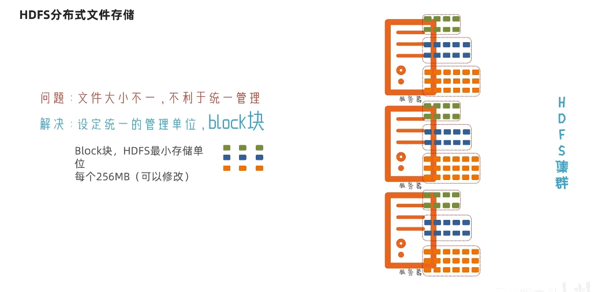
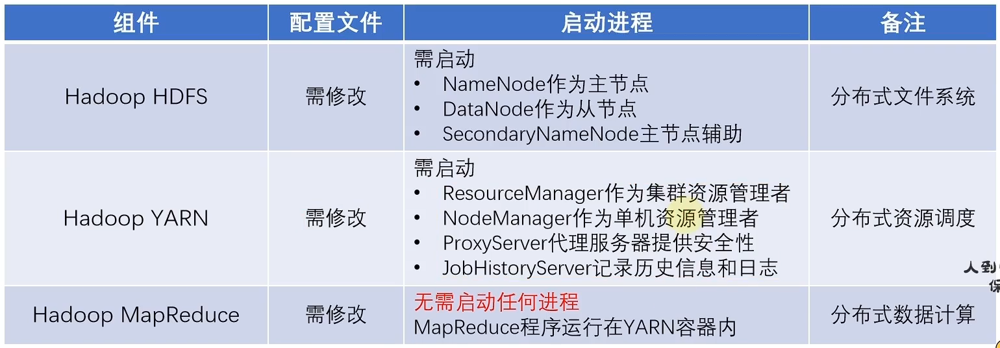

# Hadoop重点笔记

[全套笔记]: ..\..\Hadoop\hadoop3.x搭建到集群调优\笔记

[TOC]

## **1 Hadoop入门**


### 面试重点

**Hadoop组成**


**三大组件及其作用：**


**ssh免密登录：**


**常用端口号**


**常用配置文件**


## **2 HDFS**

### 2.1 HDFS架构——主从架构（面试基础）


适合场景：一次写入，多次读出

官网组成架构：


### 2.2 HDFS的Shell操作（开发重点）

1.  **一件启停**：

   ​				 `start-dfs.sh`

​						 `stop-dfs.sh`


   2. 单进程启停：

      ​			(1) 老版本：

      ​					`hadoop-daemon.sh start datanode `

      ​					`hadoop-daemon.sh stop namenode`

      ​			(2) 新版本：

      ​					`hdfs --daemon start namenode`

      ​					`hdfs --daemon stop datanode`

      

      

### 2.3 HDFS文件系统命令

*了解协议头，一般不用写*

1. **“fs“ 和 “dfs” 的区别**
   (1) fs是文件系统(file system)， dfs是分布式文件系统(distributed file system)。
   (2) fs > dfs。
   (3) 分布式环境情况下，fs与dfs无区别。
   (4) 本地环境中，fs就是本地文件，dfs就不能用了。
   (5) fs涉及到一个通用的文件系统，可以指向任何的文件系统如local，HDFS等。但是dfs仅是针对HDFS的。
   ———————————————

   

2. **创建文件夹** ——**mkdir**

   ​	`hadoop fs`适用范围广(适用于通用文件系统)（对象：可操作任何对象）： 

   ​								`hadoop fs -mkdir [-p] <path> ...`

   ​	`hdfs dfs`只适用于HDFS文件系统： 

   ​								`hdfs dfs -mkdir [-p] <path> ...`


3. **查看指定目录下内容** ——**ls**

​				`hdfs dfs -ls -h -R /`

​			

​		

4. **上传文件到HDFS指定目录下**——**put**

​				

​	*注：	`<localsrc> ...<dst>` 是host对HDFS的拷贝

5. **查看HDFS文件内容** ——**cat**

​		

​	more命令：

- ```
  - 按Space键：显示文本的下一屏内容。
  - 按Enier键：只显示文本的下一行内容。
  - 按斜线符|：接着输入一个模式，可以在文本中寻找下一个相匹配的模式。
  - 按H键：显示帮助屏，该屏上有相关的帮助信息。
  - 按B键：显示上一屏内容。
  - 按Q键：退出more命令。
  ```

  

6. **下载HDFS文件** ——**get**

   ​     

   

7.  **拷贝HDFS文件 ——cp**

    

​		*注：	`<src> ...<dst>` 是HDFS对HDFS的拷贝

​						也可进行改名操作，上面黄框中第二条可实现（源文件1.txt移动后改成666.txt）

8. **追加数据到HDFS文件中 —— appendToFile**

   ​	***注意：**HDFS文件的修改，只支持 `删除` 和 `追加` 两种操作

​		

9. **HDFS数据移动操作 —— mv**

​		

10. **HDFS数据删除操作 —— rm -r**

    ​	

​				*注：删文件不需要加 `-r`

11. **HDFS shell其他命令**

    

12. **修改权限**

    

### 2.4 HDFS分布式文件存储

#### 分布式文件存储简介

1. 如何存储

2. 三副本技术：在HDFS上，数据Block块可以有多个副本，提高数据安全性

​	

3. 副本数量的默认值的配置：

4. 检查文件的副本数——fsck 命令

   

#### NameNode结构 

- NameNode的作用

  - 保存HDFS上所有文件的元数据！
  - 接受客户端的请求！
  - 接受DataNode上报的信息，给DataNode分配任务(维护副本数)！

- 元数据**存储在**fsimage文件和edits文件中

  - fsimage(元数据的`快照`文件);
  - edits(记录所有写操作的`日志`文件)


- edits文件的产生：
  - NameNode在启动之后，每次接受的**写操作**请求，都会将写命令记录到edits文件中,edits文件每间隔一定的时间和大小滚动！

- fsimage文件的产生：

  - ①第一次格式化NN时，此时会创建NN工作的目录，其次在目录中生成一个fsimage_000000000000文件
  - ②当满足条件时 ( 下方定时条件：1小时或者100W次事务)，由SecondaryNameNode通过http从NameNode拉取edits和fsimage的数据,合并得到最新的元数据，将元数据返还NameNode，持久化到磁盘生成新的fsimage文件

  

- NameNode格式化详情

  - NameNode被格式化之后，将在/opt/module/hadoop-3.1.3/data/tmp/dfs/name/current目录中产生如下文件 

  ```
          fsimage_0000000000000000000
  
          fsimage_0000000000000000000.md5 
  
          seen_txid 
  
          VERSION
  ```

  （1）Fsimage文件：HDFS文件系统元数据的一个**永久性的检查点**，其中包含HDFS文件系统的所有目 录和文件inode的序列化信息。 

  （2）Edits文件：存放HDFS文件系统的所有更新操作的路径，文件系统客户端执行的所有写操作首先 会被记录到Edits文件中。 

  （3）seen_txid文件保存的是一个数字，就是**最后一个edits_的数字** ——`edits_inprogress_0000000000000000356` 则记录的数字是 ”356“

  （4）每次NameNode启动的时候都会将Fsimage文件读入内存，加 载Edits里面的更新操作，保证内存 中的元数据信息是最新的、同步的，可以看成NameNode启动的时候就将Fsimage和Edits文件进行了合并。


#### 元数据的合并

- 

- 元数据的合并控制参数

  

- SecondaryNameNode 的作用

  

- 综合——NameNode是如何存储文件信息的

  - NameNode将元数据存储在edits和fsimage中，edits是记录每次**写操作**的日志文件，fsimage是元数据的快照文件（用于记录最新的文件信息），在达到一小时或者100W次事务的和并条件后，SecondaryNameNode会通过http从NameNode拉取edits和fsimage的数据，合并完成后返还给NameNode生成新的fsimage文件。	

#### NN和2NN工作机制

（即NameNode 和 SecondaryNameNode）这一般是测试或者学习的环境，开发中一般用HA高可用


#### DataNode

DataNode工作机制


（1）一个数据块在 DataNode 上以文件形式存储在磁盘上，包括两个文件，一个是数据 本身，一个是元数据包括数据块的长度，块数据的校验和，以及时间戳。 

（2）DataNode 启动后向 NameNode 注册，通过后，周期性（6 小时）的向 NameNode 上 报所有的块信息。 

DN 向 NN 汇报当前解读信息的时间间隔，默认 6 小时； 


 DN 扫描自己节点块信息列表的时间，默认 6 小时 ；


（3）心跳是每 3 秒一次，心跳返回结果带有 NameNode 给该 DataNode 的命令如复制块 数据到另一台机器，或删除某个数据块。如果超过 10 分钟没有收到某个 DataNode 的心跳， 则认为该节点不可用。 

（4）集群运行中可以安全加入和退出一些机器。


**DataNode掉线时限参数设置**


### 2.5HDFS的读写流程（面试重点）

#### 2.5.1 写数据流程


(**稍微详细版本**——[55_尚硅谷_Hadoop](https://www.bilibili.com/video/BV1Qp4y1n7EN?p=55&vd_source=af897e0e9d744e904b2642117e4a5ed1))


（1）客户端通过 Distributed FileSystem 模块向 NameNode 请求上传文件，NameNode 检查目标文件是否已存在，父目录是否存在。 

（2）NameNode 返回是否可以上传。 

（3）客户端请求第一个 Block 上传到哪几个 DataNode 服务器上。 

（4）NameNode 返回 3 个 DataNode 节点，分别为 dn1、dn2、dn3。 

（5）客户端通过 FSDataOutputStream 模块请求 dn1 上传数据，dn1 收到请求会继续调用 dn2，然后 dn2 调用 dn3，将这个通信管道建立完成。 

（6）dn1、dn2、dn3 逐级应答客户端。 

（7）客户端开始往 dn1 上传第一个 Block（先从磁盘读取数据放到一个本地内存缓存）， 以 Packet 为单位，dn1 收到一个 Packet 就会传给 dn2，dn2 传给 dn3；dn1 **每传一个 packet 会放入一个应答队列等待应答**。 

（8）当一个 Block 传输完成之后，客户端再次请求 NameNode 上传第二个 Block 的服务 器。（重复执行 3-7 步）。


**网络拓扑-节点距离计算**	


**机架感知（副本存储节点选择）**


#### 2.5.2 读取流程


（1）客户端通过 DistributedFileSystem 向 NameNode 请求下载文件，NameNode 通过查 询元数据，找到文件块所在的 DataNode 地址。 

（2）挑选一台 DataNode（就近原则，然后随机）服务器，请求读取数据。 

（3）DataNode 开始传输数据给客户端（从磁盘里面读取数据输入流，以 Packet 为单位 来做校验）。 

（4）客户端以 Packet 为单位接收，先在本地缓存，然后写入目标文件。

### 面试重点

1. HDFS架构，见上

2. HDFS分布式文件存储

3. HDFS 文件块大小

   问题1：**为什么默认大小是128M、256M——基于最佳传输损耗理论？**

   不论对磁盘的文件进行读还是写，都需要先进行寻址！

   最佳传输损耗理论：在一次传输中，**寻址时间占用总传输时间的1%**时，本次传输的损耗最小，为最佳性价比传输！ 目前硬件的发展条件，普通磁盘写的速率大概为100M/s, 寻址时间一般为10ms!

   传输时间为1s的话，磁盘存储最接近100M最好，块在传输时，**每64K还需要校验一次**，因此块大小，必须为**2的n次方**，最接近100M的就是128M！

   如果公司使用的是固态硬盘，写的速度是300M/S，将块大小调整到 256M ；如果公司使用的是固态硬盘，写的速度是500M/S，将块大小调整到 512M

   因此，**HDFS的文件块大小和硬盘读写速度有关**。

   

   问题2： **为什么块的大小不能设置太小，也不能设置太大？**

   不能太大： 

   当前有文件a, 1G 

   128M一块：1G存8块   ， 取第一块 1G一块    

   1G存1块：取第一块 只需要读取a文件0-128M部分的内容

   ①在一些分块读取的场景，不够灵活，会带来额外的网络消耗 

   ②在上传文件时，一旦发生故障，会造成资源的浪费

   不能太小：

    文件a,128M 

   1M一块：  128个块，生成128个块的映射信息 

   128M一块： 1个块，一个块的映射信息 

   ①块太小，同样大小的文件，会占用过多的NN的元数据空间 

   ②块太小，在进行读写操作时，会消耗额外的寻址时间


4. HDFS的读写数据流程，见上
5. HDFS小文件问题

## **3.Map Reduce**

### 3.1分布式计算概述

MapReduce 是一个**分布式运算程序**的编程框架，是用户开发“基于 Hadoop 的数据分析 应用”的核心框架。 MapReduce 核心功能是将**用户编写的业务逻辑代码**和**自带默认组件**整合成一个完整的 **分布式运算程序**，并发运行在一个 Hadoop 集群上。


​	**分散—>汇总**模式	：Map Reduce


​		**中心调度—>步骤执行** 模式：Spark、Flink

### 3.2Map Reduce

​	Hadoop的分布式计算组件，是**分散—>汇总** 模式，供开发人员开发相关程序进行分布式数据计算。


### 3.3HDFS & MapReduce作业提交过程


### 3.4shuffle


## **4.YARN**

​     1. 分布式资源调度组件，作用：统一管理整个服务器集群资源的调度


2. YARN 的核心架构


​	**ResourceManager**：整个集群的资源调度者，负责协调调度各个程序所需的资源

​	**NodeManager**：单个服务器的资源调度者，负责调度单个服务器上的资源提供给应用程序使用。


​		YARN容器：NodeManager在资源服务器上构建一个容器Container（提前占用资源），然后将容器的资源提供给程序使用，程序运行在容器内，**无法突破容器的资源限制**。

​		

3. YARN 的辅助架构


  **Web 应用代理（Web Application Proxy）：**


5. YARN工作机制

   

   

4. 部署说明




​			查看YARN运行网页：http://node1:8088

​			一键启停无法控制历史服务器。

## **5.HDFS、YARN、MapReduce配合工作全过程**

1.  HDFS、YARN、MapReduce三者关系


## **6.Hive**


### 6.1 Hive概念

  1. 分布式SQL计算 ——Hive

     - Hive简介：
       - Hive是一个构建于Hadoop顶层的数据仓库工具（单击工具，可视为接口），可以查询和管理PB级别的分布式数据。
       - 某种程度上可以看作是**用户编程接口**，<u>本身不存储和处理数据</u>。
       - 依赖分布式文件系统HDFS存储数据。
       - 依赖分布式并行计算模型MapReduce处理数据。
       - 定义了简单的类似SQL 的查询语言——HiveSQL。
       - 用户可以通过编写的HiveQL语句运行MapReduce任务。
       - 可以很容易把原来构建在关系数据库上的数据仓库应用程序移植到Hadoop平台上。

     - Hive主要作用：**将SQL语言翻译成MapReduce程序运行**

     

     - 分布式SQL计算实现需求：

     

     - 核心组件：			 

       - 元数据管理：帮助记录各类元数据（元数据 即描述数据的数据，Hive的元数据，默认是存储在derby中）

       - SQL解析器：完成SQL到MapReduce程序的转换

2. Hive基础架构

    三部分：元数据管理、SQL解析器、用户接口

   

   


 3. 部署启动Hive（略——具体问题具体分析）

    

4. HiveServer2服务

   

   


### 6.2 Hive-SQL使用语法

[Hive-SQL语法笔记]: C:\Users\WorkDevice\Desktop\Hive-SQL语法大全.md


## **7.数据仓库**

### 7.1 分层概念

​	1. 


