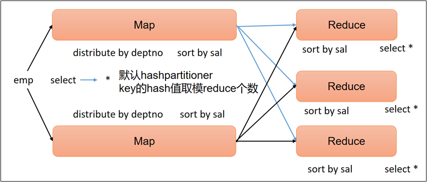
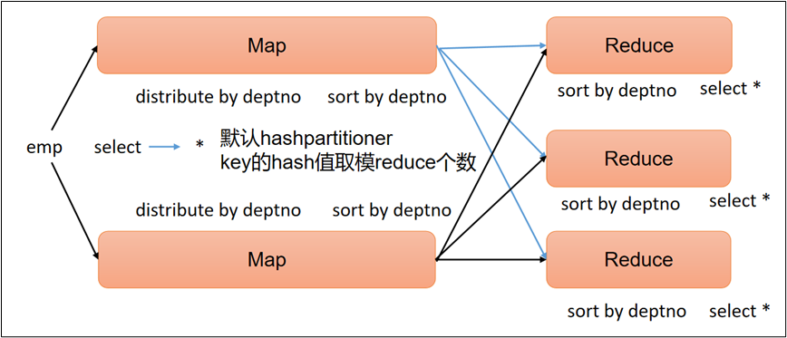
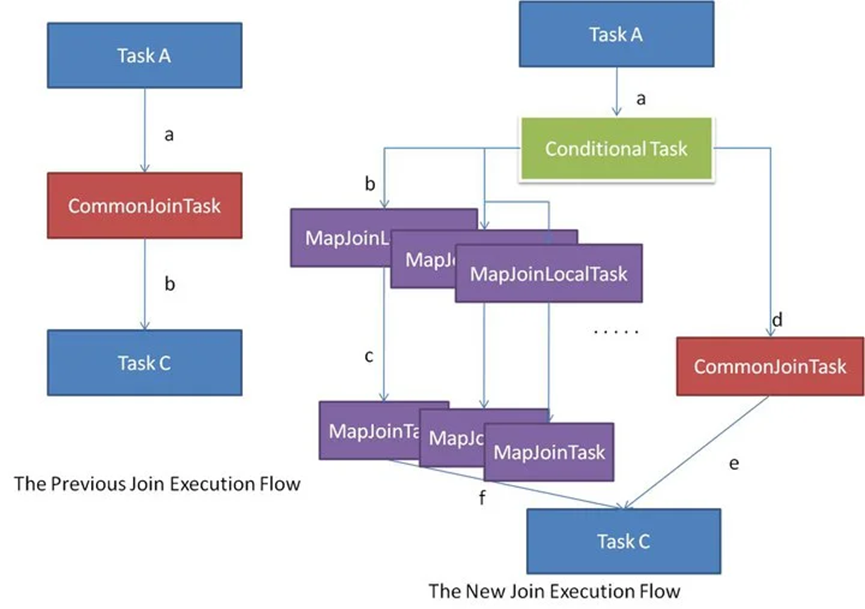
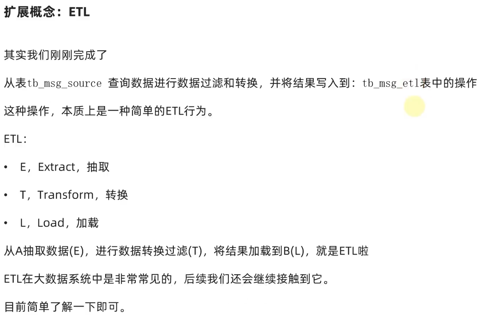

# HiveNotes

[hive笔记（atguigu）]: ..\..\Hive3.1.3\笔记\尚硅谷大数据技术之Hive（V4.8.0）.docx

[TOC]

## Hive概念

### 分布式SQL计算 ——Hive

- Hive简介：

  - Hive是一个构建于Hadoop顶层的**数据仓库工具**（单击工具，可视为接口），可以将**结构化的数据文件映射为一张表**，并提供**类SQL**查询功能。可以查询和管理PB级别的分布式数据。
  - 某种程度上可以看作是**用户编程接口**，<u>本身不存储和处理数据</u>。
  - 依赖分布式文件系统HDFS存储数据。
  - 依赖分布式并行计算模型MapReduce处理数据。
  - 定义了简单的**类似SQL** 的查询语言——**HiveSQL**。
  - 用户可以通过编写的HiveQL语句运行MapReduce任务。
  - 可以很容易把原来构建在关系数据库上的数据仓库应用程序移植到Hadoop平台上。

- Hive主要作用：**将SQL语言翻译成MapReduce程序运行**

- Hive本质：

  （1）Hive中每张表的数据存储在HDFS

  （2）Hive分析数据底层的实现是MapReduce（也可配置为Spark或者Tez）

  （3）执行程序运行在Yarn上

  ​		

- 分布式SQL计算实现需求：

- 核心组件：			 

  - 元数据管理：帮助记录各类元数据（元数据 即描述数据的数据，Hive的元数据，默认是存储在derby中）

  - SQL解析器：完成SQL到MapReduce程序的转换

### Hive基础架构

三部分：元数据管理、SQL解析器/驱动器Driver、用户接口


**1）用户接口：Client**

CLI（command-line interface）、JDBC/ODBC。

说明：JDBC和ODBC的区别。

（1）JDBC的移植性比ODBC好；（通常情况下，安装完ODBC驱动程序之后，还需要经过确定的配置才能够应用。而不相同的配置在不相同数据库服务器之间不能够通用。所以，安装一次就需要再配置一次。JDBC只需要选取适当的JDBC数据库驱动程序，就不需要额外的配置。在安装过程中，JDBC数据库驱动程序会自己完成有关的配置。）

（2）两者使用的语言不同，JDBC在Java编程时使用，ODBC一般在C/C++编程时使用。

**2）元数据：Metastore**

元数据包括：数据库（默认是default）、表名、表的拥有者、列/分区字段、表的类型（是否是外部表）、表的数据所在目录等。

默认存储在自带的derby数据库中，由于derby数据库只支持单客户端访问，生产环境中为了多人开发，推荐使用MySQL存储Metastore。

**3）驱动器：Driver**

（1）解析器（SQLParser）：将SQL字符串转换成抽象语法树（AST）

​          词法分析+语法分析

（2）语义分析（Semantic Analyzer）：将抽象语法树AST进一步划分为QeuryBlock

（3）逻辑计划生成器（Logical Plan Gen）：将语法树生成逻辑计划

（4）逻辑优化器（Logical Optimizer）：对逻辑计划进行优化

（5）物理计划生成器（Physical Plan Gen）：根据优化后的逻辑计划生成物理计划

（6）物理优化器（Physical Optimizer）：对物理计划进行优化

（7）执行器（Execution）：执行该计划，得到查询结果并返回给客户端


### 部署启动Hive

（略——具体问题具体分析）


### HiveServer2服务


## 基于语法描述说明

```sql
CREATE DATABASE [IF NOT EXISTS] db_name [LOCATION] 'path';
SELECT expr, ... FROM tbl ORDER BY col_name [ASC | DESC]
(A | B | C)
```

如上语法，在语法描述中出现：

- `[]`，表示可选，如上`[LOCATION] `表示可写、可不写
- `|`，表示或，如上`ASC | DESC`，表示二选一

- ...，表示序列，即未完结，如上`SELECT expr, ...` 表示在SELECT后可以跟多个`expr（查询表达式）`，以逗号隔开
- `()`，表示必填，如上(A | B | C)表示此处必填，填入内容在A、B、C中三选一


## 数据库操作

### 创建数据库

```sql
CREATE DATABASE [IF NOT EXISTS] db_name [LOCATION 'path'] [COMMENT database_comment];
```

- `IF NOT EXISTS`，如存在同名数据库`不执行任何操作`，否则`执行创建数据库`操作
- `[LOCATION]`，自定义数据库存储位置，`如不填写`，默认数据库在HDFS的路径为：`/user/hive/warehouse`

- `[COMMENT database_comment]`，可选，数据库注释


### 删除数据库

```sql
DROP DATABASE [IF EXISTS] db_name [CASCADE];
```

- `[IF EXISTS]`，可选，如果存在此数据库执行删除，不存在不执行任何操作
- `[CASCADE]`，可选，级联删除，即数据库内存在表，使用CASCADE可以强制删除数据库


### 数据库修改LOCATION

```sql
ALTER DATABASE database_name SET LOCATION hdfs_path;
```

==不会在HDFS对数据库所在目录进行改名，只是修改location后，新创建的表在新的路径，旧的不变==


### 选择数据库

```sql
USE db_name;
```

- 选择数据库后，后续`SQL`操作基于当前选择的库执行
- 如不使用use，默认在`default`库执行

**若想切换回使用default库**

```sql
USE DEFAULT;
```


**查询当前USE的数据库**

```sql
SELECT current_database();
```


## 表操作

### 数据类型


| **分类** | **类型**      | **描述**                                       | **字面量示例**                                               |
| -------- | ------------- | ---------------------------------------------- | ------------------------------------------------------------ |
| 原始类型 | BOOLEAN       | true/false                                     | TRUE                                                         |
|          | TINYINT       | 1字节的有符号整数 -128~127                     | 1Y                                                           |
|          | SMALLINT      | 2个字节的有符号整数，-32768~32767              | 1S                                                           |
|          | **INT**       | 4个字节的带符号整数                            | 1                                                            |
|          | BIGINT        | 8字节带符号整数                                | 1L                                                           |
|          | FLOAT         | 4字节单精度浮点数1.0                           |                                                              |
|          | **DOUBLE**    | 8字节双精度浮点数                              | 1.0                                                          |
|          | DEICIMAL      | 任意精度的带符号小数                           | 1.0                                                          |
|          | **STRING**    | 字符串，变长                                   | “a”,’b’                                                      |
|          | **VARCHAR**   | 变长字符串                                     | “a”,’b’                                                      |
|          | CHAR          | 固定长度字符串                                 | “a”,’b’                                                      |
|          | BINARY        | 字节数组                                       |                                                              |
|          | **TIMESTAMP** | 时间戳，毫秒值精度                             | 122327493795                                                 |
|          | **DATE**      | 日期                                           | ‘2016-03-29’                                                 |
|          |               | 时间频率间隔                                   |                                                              |
| 复杂类型 | ARRAY         | 有序的的同类型的集合                           | array(1,2)                                                   |
|          | MAP           | key-value,key必须为原始类型，value可以任意类型 | map(‘a’,1,’b’,2)                                             |
|          | STRUCT        | 字段集合,类型可以不同                          | struct(‘1’,1,1.0), named_stract(‘col1’,’1’,’col2’,1,’clo3’,1.0) |
|          | UNION         | 在有限取值范围内的一个值                       | create_union(1,’a’,63)                                       |


### 基础建表

```sql
CREATE [EXTERNAL] TABLE tb_name
	(col_name col_type [COMMENT col_comment], ......)
	[COMMENT tb_comment]
	[PARTITIONED BY(col_name, col_type, ......)]
	[CLUSTERED BY(col_name, col_type, ......) INTO num BUCKETS]
	[ROW FORMAT DELIMITED FIELDS TERMINATED BY '']
	[LOCATION 'path']
```

- 内部表示例：

  ```sql
  CREATE TABLE text(
  			id INT,
      		name STRING,
      		gender STRING
  );
  ```

- 内部表与外部表对比：

  

  转换内外表：stu set tblproperties('EXTERNAL'='TRUE/FALSE')

- `[EXTERNAL]`，外部表，需搭配（必须指定分隔符和location）

  - **`[ROW FORMAT DELIMITED FIELDS TERMINATED BY '']`指定列分隔符**

  - **`[LOCATION 'path']`表数据路径**

  - 外部表示意：

    ```sql
    CREATE EXTERNAL TABLE test_ext(id int) COMMENT 'external table' ROW FORMAT DELIMITED FIELDS TERMINATED BY '\t' LOCATION 'hdfs://node1:8020/tmp/test_ext';
    ```

    

- `[COMMENT tb_comment]`表注释，可选

- `[PARTITIONED BY(col_name, col_type, ......)]`基于列分区

  ```sql
  -- 分区表示意
  CREATE TABLE test_ext(id int) COMMENT 'partitioned table' PARTITION BY(year string, month string, day string) ROW FORMAT DELIMITED FIELDS TERMINATED BY '\t';
  ```

- `[CLUSTERED BY(col_name, col_type, ......)]`基于列分桶

  ```sql
  CREATE TABLE course (c_id string,c_name string,t_id string) CLUSTERED BY(c_id) INTO 3 BUCKETS ROW FORMAT DELIMITED FIELDS TERMINATED BY '\t';
  ```

### **内部表与外部表的区别（重要）**

#### 内部表（Managed Tables）

- **数据管理**：当你创建一个内部表时，Hive会对存储在表中的数据拥有完全的控制权。这意味着Hive负责数据的生命周期，包括数据的存储和删除。
- **数据删除**：当你删除一个内部表时，<u>Hive不仅会删除表的元数据，还会删除存储数据的文件。</u>这个操作是不可逆的，即删除表将导致数据的永久丢失。
- **使用场景**：内部表适用于那些完全由Hive管理且不需要与外部应用共享的数据。例如，临时数据分析或者只在Hive中使用的数据集。

#### 外部表（External Tables）

- **数据管理**：创建外部表时，Hive不管理数据的存储，只管理数据的元数据。数据文件可以存在于Hive之外的任何地方，如HDFS的特定位置或其他存储系统。
- **数据删除**：当你删除一个外部表时，<u>Hive只会删除表的元数据，而数据文件本身不会被删除</u>。（分区的删除同理）这使得其他应用或过程仍然可以访问原始数据。
- **使用场景**：外部表适合于需要在多个计算框架之间共享的数据。例如，当数据由不同的应用产生并被多个分析工具使用时，使用外部表是一个更好的选择。

#### 比较和选择

在选择使用内部表还是外部表时，你需要考虑数据管理的需求和数据的使用场景。如果数据仅在Hive中使用，并且希望Hive完全管理数据的生命周期，那么内部表是合适的选择。相反，如果数据需要跨多个应用共享，或者你希望在删除表结构后仍保留数据文件，那么外部表会是更好的选择。


### 基于其它表的结构建表

```sql
CREATE TABLE tbl_name LIKE other_tbl;
```


### 基于查询结果建表

```sql
CREATE TABLE tbl_name AS SELECT ...;
```


### 删除表

```sql
DROP TABLE tbl;
```


### 修改表

**重命名**

```sql
ALTER TABLE old RENAME TO new;
```


**修改属性**

```sql
ALTER TABLE tbl SET TBLPROPERTIES(key=value);
-- 常用属性
("EXTERNAL"="TRUE") -- 内外部表，TRUE表示外部表
('comment' = new_comment) -- 修改表注释
-- 其余属性参见
https://cwiki.apache.org/confluence/display/Hive/LanguageManual+DDL#LanguageManualDDL-listTableProperties
```


### 分区操作


**创建分区表**

```hive
-- 分区表示意
CREATE TABLE test_ext(id int) COMMENT 'partitioned table' PARTITION BY(year string, month string, day string) 
ROW FORMAT DELIMITED FIELDS TERMINATED BY '\t';
```

在加载数据后，数据 = 数据列 + 分区列（由分区表在PARTITION BY中定义）

**添加分区**

```sql
ALTER TABLE tablename ADD PARTITION (partition_key='partition_value', ......);
```

添加多个分区

```hive
ALTER TABLE tablename 
ADD PARTITION (partition_key='partition_value', ......)	--没有逗号
ADD PARTITION (partition_key='partition_value', ......)
```

**删除分区**

```sql
ALTER TABLE tablename DROP PARTITION (partition_key='partition_value');
```

> 删除分区后，只是在元数据中删除，即删除元数据库中：
>
> - `PARTITION`表
> - `SDS`表
>
> 相关记录
>
> ==分区所在的HDFS文件夹依旧保留==

删除多个分区

```hive
ALTER TABLE tablename 
DROP PARTITION (partition_key='partition_value'), --必须有逗号，和添加分区有区别
DROP PARTITION (partition_key='partition_value'),
DROP PARTITION (partition_key='partition_value');
```

**修改分区值**

```sql
ALTER TABLE tablename PARTITION (partition_key='old_partition_value') RENAME TO PARTITION (partition_key='new_partition_value');
```

==注意==

只会在元数据中修改，不会同步修改HDFS路径吗，如：

- 原分区路径为：`/user/hive/warehouse/test.db/test_table/month=201910`，分区名：`month='201910'`
- 将分区名修改为：`201911`后，分区所在路径不变，依旧是：`/user/hive/warehouse/test.db/test_table/month=201910`


如果希望修改分区名后，同步修改HDFS的路径，并保证正常可用，需要：

- 在元数据库中：`找到SDS表` -> `找到LOCATION列` -> `找到对应分区的路径记录进行修改`
  - 如将记录的：`/user/hive/warehouse/test.db/test_table/month=201910` 修改为：`/user/hive/warehouse/test.db/test_table/month=201911`
- 在HDFS中，同步修改文件夹名
  - 如将文件夹：`/user/hive/warehouse/test.db/test_table/month=201910` 修改为：`/user/hive/warehouse/test.db/test_table/month=201911`

**加载数据**

LOAD DATA

```sql
LOAD DATA [LOCAL] INPATH 'path' INTO TABLE tbl PARTITION(partition_key='partition_value');
```

INSERT SELECT

```sql
INSERT (OVERWRITE | INTO) TABLE tbl PARTITION(partition_key='partition_value') SELECT ... FROM ...;
```

**修复分区**

若出现元数据和HDFS路径不一致的情况，但<u>Hive感知不到</u>，可通过如下几种手段进行修复。

<u>**原则：以HDFS为标准，修Hive中MetaStore的元数据**</u>

**（1）add partition**

若手动创建HDFS的分区路径，Hive无法识别，可通过add partition命令增加分区元数据信息，从而使元数据和分区路径保持一致。

**（2）drop partition**

若手动删除HDFS的分区路径，Hive无法识别，可通过drop partition命令删除分区元数据信息，从而使元数据和分区路径保持一致。

**（3）msck repair table**

msck（ MetaStore Check）若分区元数据和HDFS的分区路径不一致，还可使用msck命令进行修复，以下是该命令的用法说明。

```hive
msck repair table table_name [add/drop/sync partitions];
```

说明：

`msck repair table table_name add partitions`：该命令会增加HDFS路径存在但元数据缺失的分区信息。

`msck repair table table_name drop partitions`：该命令会删除HDFS路径已经删除但元数据仍然存在的分区信息。

`msck repair table table_name sync partitions`：该命令会同步HDFS路径和元数据分区信息，相当于同时执行上述的两个命令。

`msck repair table table_name`：等价于`msck repair table table_name add partitions`命令。


**动态分区**

动态分区是指向分区表insert数据时，被写往的分区不由用户指定，而是由每行数据的最后一个字段的值来动态的决定。使用动态分区，可只用一个insert语句将数据写入多个分区。

1. 动态分区相关参数

（注意，可能会因为其中的参数导致动态分区失败/ 报错，因此实际情况可能要修改某些参数）

（1）动态分区功能总开关（默认true，开启）

```hive
set hive.exec.dynamic.partition=true
```

（2）严格模式和非严格模式

动态分区的模式，默认strict（严格模式），要求必须指定至少一个分区为静态分区，nonstrict（非严格模式）允许所有的分区字段都使用动态分区。

```hive
set hive.exec.dynamic.partition.mode=nonstrict
```

（3）一条insert语句可同时创建的最大的分区个数，默认为1000。

```hive
set hive.exec.max.dynamic.partitions=1000
```

（4）单个Mapper或者Reducer可同时创建的最大的分区个数，默认为100。

```hive
set hive.exec.max.dynamic.partitions.pernode=100
```

（5）一条insert语句可以创建的最大的文件个数，默认100000。

```hive
hive.exec.max.created.files=100000
```

（6）当查询结果为空时且进行动态分区时，是否抛出异常，默认false。

```hive
hive.error.on.empty.partition=false
```

2. 案例实操

   需求：将dept表中的数据按照地区（loc字段），插入到目标表dept_partition_dynamic的相应分区中。

   （1）创建目标分区表

   ```hive
   create table dept_partition_dynamic(
     id int, 
     name string
   ) 
   partitioned by (loc int) 
   row format delimited fields terminated by '\t';
   ```

   （2）设置动态分区

   ```hive
   set hive.exec.dynamic.partition.mode = nonstrict;
   --上面的动态分区需要设置成非严格模式，因为只有一个分区字段
   insert into table dept_partition_dynamic partition(loc) --不用指定具体字段值，而是用下面select最后一个字段值进行动态分区
   select 
     deptno, 
     dname, 
     loc 	--按照这个字段进行分区
   from dept;
   ```

   （3）查看目标分区表的分区情况

   ```hive
   show partitions dept_partition_dynamic;
   ```

   

### 分桶操作


进行分桶操作后，可以对特定操作，如：过滤、JOIN、分组，均可带来性能提升。因为对被CLUSTERED BY的同一特征进行取模运算后，就可以知道该特征的其他所有值都在该桶中。


**建表**

```sql
CREATE TABLE course (c_id string,c_name string,t_id string) 
[PARTITION(partition_key='partition_value')] 
CLUSTERED BY(c_id) INTO 3 BUCKETS 
ROW FORMAT DELIMITED FIELDS TERMINATED BY '\t';
```

- `CLUSTERED BY(col)` 指定分桶列
- `INTO 3 BUCKETS`，设定3个桶

> 分桶表需要开启：
>
> `set hive.enforce.bucketing=true;`
>
> 设置自动匹配桶数量的reduces task数量

**数据加载**

```sql
INSERT (OVERWRITE | INTO) TABLE tbl 
[PARTITION(partition_key='partition_value')] 
SELECT ... FROM ... CLUSTER BY(col);
```

==分桶表无法使用LOAD DATA进行数据加载==

在3.x之后，LOAD进行了增强，可以用进行数据加载了。

```hive
load data local inpath'./opt/module/hive/datas/student.txt'
into table stu_buck;
```

**分桶排序表**

### 10.2.2 分桶排序表

1）建表语句

```hive
create table stu_buck_sort(
  id int, 
  name string
)
clustered by(id) sorted by(id)
into 4 buckets
row format delimited fields terminated by '\t';
```

2）数据装载

（1）导入数据到分桶表中

```hive
load data local inpath '/opt/module/hive/datas/student.txt' 
into table stu_buck_sort;
```

（2）查看创建的分桶表中是否分成4个桶


（3）观察每个分桶中的数据


### **分桶与分区的区别**

- 数据组织： 
  - 分区按照**键值**将数据（如时间字段）进行分区；
  - 分桶按照**哈希算法**将数据均匀分配到不同文件中；
- 目的：
  - 分区用于减少查询中需要扫描的数据量；
  - 分桶用于改善特定类型的查询的性能，如JOIN和采样；
- 性能优化：
  - 分区是通过避免全表扫描来优化查询
  - 分桶是通过确保数据分布均匀和优化数据连接操作来提高性能


### 数据加载

**LOAD DATA**

将数据**文件**加载到表

```sql
LOAD DATA [LOCAL] INPATH 'path' [OVERWRITE] INTO TABLE tbl [PARTITION(partition_key='partition_value')];	-- 指定分区可选
```

注意：不带[LOCAL]，是基于HDFS进行load加载数据，源数据文件会消失（本质是被移动到表所在的目录中）

​			 [OVERWRITE]表示覆盖

**INSERT SELECT**

将**其它表**数据，加载到目标表

```sql
INSERT (OVERWRITE | INTO) TABLE tbl 
	[PARTITION(partition_key='partition_value')] 		-- 指定分区，可选
	SELECT ... FROM ... [CLUSTER BY(col)];				-- 指定分桶列，可选
```

​	overwrite覆盖，into追加

**VALUES**

直接写入数据

```hive
insert overwrite table tb1 values();
```


### 数据导出

**INSERT OVERWRITE SELECT**

```sql
INSERT OVERWRITE [LOCAL] DIRECTORY ‘path’ 				-- LOCAL可选，带LOCAL导出Linux本地，不带LOCAL导出到HDFS
	[ROW FORMAT DELIMITED FIELDS TERMINATED BY '']		-- 可选，自定义列分隔符
	SELECT ... FROM ...;
```


**bin/hive**

- `bin/hive -e 'sql' > export_file` 将`sql`结果重定向到导出文件中
- `bin/hive -f 'sql_script_file' > export_file` 将`sql脚本`执行的结果重定向到导出文件中


**Export&Import**

Export导出语句可将表的数据和元数据信息一并到处的HDFS路径，Import可将Export导出的内容导入Hive，表的数据和元数据信息都会恢复。Export和Import可用于两个Hive实例之间的数据迁移。

**1** **语法**

--导出

**EXPORT TABLE** tablename **TO** 'export_target_path'

--导入

**IMPORT** [**EXTERNAL**] **TABLE** new_or_original_tablename **FROM** 'source_path' [**LOCATION** 'import_target_path']

**2** **案例**

--导出

hive>

export table default.student to '/user/hive/warehouse/export/student';

--导入

hive>

import table student2 from '/user/hive/warehouse/export/student';

### 复杂类型

| **类型** | **定义**                            | **示例**                                                     | **内含元素类型**                | **元素个数**               | **取元素**                         | **可用函数**                                                 |
| -------- | ----------------------------------- | ------------------------------------------------------------ | ------------------------------- | -------------------------- | ---------------------------------- | ------------------------------------------------------------ |
| array    | array<类型>                         | 如定义为array<int>数据为：1,2,3,4,5                          | 单值，类型取决于定义            | 动态，不限制               | array[数字序号] 序号从0开始        | size统计元素个数 array_contains判断是否包含指定数据          |
| map      | map<key类型, value类型>             | 如定义为：map<string, int>数据为：{’a’: 1, ‘b’: 2, ‘c’: 3}   | 键值对，K-V，K和V类型取决于定义 | 动态，不限制               | map[key] 取出对应key的value        | size统计元素个数array_contains判断是否包含指定数据 map_keys取出全部key，返回array map_values取出全部values，返回array |
| struct   | struct<子列名 类型, 子列名 类型...> | 如定义为：struct<c1 string, c2 int, c3 date>数据为：’a’, 1, ‘2000-01-01’ | 单值，类型取决于定义            | 固定，取决于定义的子列数量 | struct.子列名 通过子列名取出子列值 | 暂无                                                         |

#### 1. 数组(单列集合)——array<类型>


数组中包含方法：

```
ARRAY_CONTAINS(work_location, 'tianjin')
```

#### 2. 双列集合——map<key类型, value类型>

建表语句：

```hive
create table myhive.test_map(
	id int,
    name string,
    members map<string,string>
    age int
)
row format delimited fields terminated by ','
collection items terminated by "#"		# 每个键值对之间的分隔符
map keys terminated by ':'		# 单个键值对内部，key和value的分隔符

-- 查看成员中，每个人的父亲,母亲是谁
select id, name, members['father'], members['mother'] from myhive.test_map;

-- 去除map的全部key/values， 返回类型array
select map_keys(members) from myhive.test_map;
select map_values(members) from myhive.test_map;

-- size查看键值对的个数
select size(members) from myhive.test_map;

--array_contains查看指定数据是否包含在map中，看看谁有sister这个key
select * from myhive.test_map where ARRAY_CONTAINS(map_keys(members),'sister');
```


#### 3. 二级列(结构体)——struct<子列名 类型, 子列名 类型...>


## **查询**

*数据查询的课堂SQL记录*

### 基本查询

```sql
create database itheima;
use itheima;
CREATE TABLE itheima.orders (
    orderId bigint COMMENT '订单id',
    orderNo string COMMENT '订单编号',
    shopId bigint COMMENT '门店id',
    userId bigint COMMENT '用户id',
    orderStatus tinyint COMMENT '订单状态 -3:用户拒收 -2:未付款的订单 -1：用户取消 0:待发货 1:配送中 2:用户确认收货',
    goodsMoney double COMMENT '商品金额',
    deliverMoney double COMMENT '运费',
    totalMoney double COMMENT '订单金额（包括运费）',
    realTotalMoney double COMMENT '实际订单金额（折扣后金额）',
    payType tinyint COMMENT '支付方式,0:未知;1:支付宝，2：微信;3、现金；4、其他',
    isPay tinyint COMMENT '是否支付 0:未支付 1:已支付',
    userName string COMMENT '收件人姓名',
    userAddress string COMMENT '收件人地址',
    userPhone string COMMENT '收件人电话',
    createTime timestamp COMMENT '下单时间',
    payTime timestamp COMMENT '支付时间',
    totalPayFee int COMMENT '总支付金额'
) ROW FORMAT DELIMITED FIELDS TERMINATED BY '\t';

load data local inpath '/home/hadoop/itheima_orders.txt' into table itheima.orders;

CREATE TABLE itheima.users (
    userId int,
    loginName string,
    loginSecret int,
    loginPwd string,
    userSex tinyint,
    userName string,
    trueName string,
    brithday date,
    userPhoto string,
    userQQ string,
    userPhone string,
    userScore int,
    userTotalScore int,
    userFrom tinyint,
    userMoney double,
    lockMoney double,
    createTime timestamp,
    payPwd string,
    rechargeMoney double
) ROW FORMAT DELIMITED FIELDS TERMINATED BY '\t';

load data local inpath '/home/hadoop/itheima_users.txt' into table itheima.users;

-- 查询全表数据
SELECT * FROM itheima.orders;

-- 查询单列信息
SELECT orderid, userid, totalmoney FROM itheima.orders o ;

-- 查询表有多少条数据
SELECT COUNT(*) FROM itheima.orders;

-- 过滤广东省的订单
SELECT * FROM itheima.orders WHERE useraddress LIKE '%广东%';

-- 找出广东省单笔营业额最大的订单
SELECT * FROM itheima.orders WHERE useraddress LIKE '%广东%'
ORDER BY totalmoney DESC LIMIT 1;

-- 统计未支付、已支付各自的人数
SELECT ispay, COUNT(*) FROM itheima.orders o GROUP BY ispay ;

-- 在已付款的订单中，统计每个用户最高的一笔消费金额
SELECT userid, MAX(totalmoney) FROM itheima.orders WHERE ispay = 1 GROUP BY userid;
-- 统计每个用户的平均订单消费额
SELECT userid, AVG(totalmoney) FROM itheima.orders GROUP BY userid;
-- 统计每个用户的平均订单消费额，并过滤大于10000的数据
SELECT userid, AVG(totalmoney) AS avg_money FROM itheima.orders GROUP BY userid HAVING avg_money > 10000;

-- 订单表和用户表JOIN 找出用户username
SELECT o.orderid, o.userid, u.username FROM itheima.orders o JOIN itheima.users u ON o.userid = u.userid;
SELECT o.orderid, o.userid, u.username FROM itheima.orders o LEFT JOIN itheima.users u ON o.userid = u.userid;

```

### 排序

#### 全局排序（Order By）

Order By：全局排序，只有一个Reduce。

**1）使用Order By子句排序**

​	asc（ascend）：升序（默认）

​	desc（descend）：降序

**2）Order By子句在select语句的结尾**

**3）基础案例实操** 

​	（1）查询员工信息按工资升序排列

```hive
hive (default)> 
select * 
from emp 
order by sal;
```

hive sql执行过程：

​	（2）查询员工信息按工资降序排列

```hive
hive (default)> 
select	* 
from emp 
order by sal desc;
```

**4）按照别名排序案例实操**

​	按照员工薪水的2倍排序。

```hive
hive (default)> 
select 
 	ename, 
 	sal * 2 twosal 
from emp 
order by twosal;
```

hive sql执行过程：

**5）多个列排序案例实操**

​	按照部门和工资升序排序。

```hive
hive (default)> 
select 
  ename, 
  deptno, 
  sal 
from emp 
order by deptno, sal;
```

hive sql执行过程：

#### 每个Reduce内部排序（Sort By）

Sort By：对于大规模的数据集order by的效率非常低。在很多情况下，并不需要全局排序，此时可以使用**Sort by**。

Sort by为每个reduce产生一个排序文件。每个Reduce内部进行排序，对全局结果集来说不是排序。

**1）设置reduce个数**

```hive
hive (default)> set mapreduce.job.reduces=3;
```

**2）查看设置reduce个数**

```hive
hive (default)> set mapreduce.job.reduces;
```

**3）根据部门编号降序查看员工信息**

```hive
hive (default)> 
select * 
from emp 
sort by deptno desc;
```

hive sql执行过程：

**4）将查询结果导入到文件中（按照部门编号降序排序）**

```hive
hive (default)> insert overwrite local directory '/opt/module/hive/datas/sortby-result'
 select * from emp sort by deptno desc;
```


#### 分区（Distribute By）

Distribute By：在有些情况下，我们需要控制某个特定行应该到哪个Reducer，通常是为了进行后续的聚集操作。**distribute by**子句可以做这件事。**distribute by**类似MapReduce中partition（自定义分区），进行分区，结合sort by使用。 

对于distribute by进行测试，一定要分配多reduce进行处理，否则无法看到distribute by的效果。

**1）案例实操：**

​	（1）先按照部门编号分区，再按照员工编号薪资排序

```hive
hive (default)> set mapreduce.job.reduces=3;
hive (default)> 
insert overwrite local directory 
'/opt/module/hive/datas/distribute-result'
select * 
from emp 
distribute by deptno 
sort by sal desc;
```

注意：

Ø distribute by的分区规则是根据分区字段的hash码与reduce的个数进行相除后，余数相同的分到一个区。

Ø Hive要求**distribute by**语句要写在sort by语句之前。

Ø 演示完以后mapreduce.job.reduces的值要设置回-1，否则下面分区or分桶表load跑MapReduce的时候会报错。

hive sql执行过程：

####  分桶（Cluster By）

当distribute by和sort by字段相同时，可以使用cluster by方式。

cluster by除了具有distribute by的功能外还兼具sort by的功能。但是排序**只能是升序排序**，不能指定排序规则为asc或者desc。

（1）以下两种写法等价

```hive
**hive (default)>** 
select * 
from emp 
cluster by deptno;

**hive (default)>** 
select * 
from emp 
distribute by deptno 
sort by deptno;
```

注意：按照部门编号分区，不一定就是固定死的数值，可以是20号和30号部门分到一个分区里面去。

hive sql执行过程：

​     

### RLIKE


```sql
-- 查找广东省数据
SELECT * FROM itheima.orders WHERE useraddress RLIKE '.*广东.*';
-- 查找用户地址是：xx省 xx市 xx区
SELECT * FROM itheima.orders WHERE useraddress RLIKE '..省 ..市 ..区';
-- 查找用户姓为：张、王、邓
SELECT * FROM itheima.orders WHERE username RLIKE '[张王邓]\\S+';
-- 查找手机号符合：188****0*** 规则
SELECT * FROM itheima.orders WHERE userphone RLIKE '188\\S{4}0[0-9]{3}';
```


### UNION联合 和 JOIN操作

UNION  不去重，UNION ALL 去重

```sql
CREATE TABLE itheima.course(
c_id string, 
c_name string, 
t_id string)
ROW FORMAT DELIMITED FIELDS TERMINATED BY '\t';

LOAD DATA LOCAL INPATH '/home/hadoop/course.txt' INTO TABLE itheima.course;
-- 基础UNION
SELECT * FROM itheima.course WHERE t_id = '周杰轮'
	UNION
SELECT * FROM itheima.course WHERE t_id = '王力鸿';
-- 去重演示
SELECT * FROM itheima.course
	UNION
SELECT * FROM itheima.course;
-- 不去重
SELECT * FROM itheima.course
	UNION ALL
SELECT * FROM itheima.course;
-- UNION写在FROM中 UNION写在子查询中
SELECT t_id, COUNT(*) FROM 
(
	SELECT * FROM itheima.course WHERE t_id = '周杰轮'
		UNION ALL
	SELECT * FROM itheima.course WHERE t_id = '王力鸿' 
) AS u GROUP BY t_id;

-- 用于INSERT SELECT
INSERT OVERWRITE TABLE itheima.course2
SELECT * FROM itheima.course 
	UNION
SELECT * FROM itheima.course;
```


```hive
#1. 中图：内连接 A∩B
SELECT employee_id,last_name,department_name
FROM employees e JOIN departments d
ON e.`department_id` = d.`department_id`;
```

```hive
#2. 左上图：左外连接
SELECT employee_id,last_name,department_name
FROM employees e LEFT JOIN departments d
ON e.`department_id` = d.`department_id`;
```

```hive
#3. 右上图：右外连接
SELECT employee_id,last_name,department_name
FROM employees e RIGHT JOIN departments d
ON e.`department_id` = d.`department_id`;
```

```hive
#4. 左中图：A - A∩B
SELECT employee_id,last_name,department_name
FROM employees e LEFT JOIN departments d
ON e.`department_id` = d.`department_id`
WHERE d.`department_id` IS NULL
```

```hive
#5. 右中图：B-A∩B
SELECT employee_id,last_name,department_name
FROM employees e RIGHT JOIN departments d
ON e.`department_id` = d.`department_id`
WHERE e.`department_id` IS NULL

```

```hive
#6. 左下图：满外连接
#(4+3)	左中图 + 右上图 A∪B 
SELECT employee_id,last_name,department_name
FROM employees e LEFT JOIN departments d
ON e.`department_id` = d.`department_id`
WHERE d.`department_id` IS NULL

UNION ALL #没有去重操作，效率高

SELECT employee_id,last_name,department_name
FROM employees e RIGHT JOIN departments d
ON e.`department_id` = d.`department_id`;

```

```hive
#7. 右下图
#(4+5)	左中图 + 右中图 A ∪B- A∩B 或者 (A - A∩B) ∪ （B - A∩B）
SELECT employee_id,last_name,department_name
FROM employees e LEFT JOIN departments d
ON e.`department_id` = d.`department_id`
WHERE d.`department_id` IS NULL

UNION ALL

SELECT employee_id,last_name,department_name
FROM employees e RIGHT JOIN departments d
ON e.`department_id` = d.`department_id`
WHERE e.`department_id` IS NULL

```


### Sampling采样 *

**随机桶抽样** 和 **数据块抽样**

```sql
# 随机桶抽取， 分配桶是有规则的
# 可以按照列的hash取模分桶

# 1.随机桶抽样，按照完全随机分桶
SELECT ... FROM tb1 TABLESAMPLE(BUCKET x OUT OF y ON ( colname | rand() ))
#TABLESAMPLE 表示随机抽样
#BUCKET x OUT OF y 表示将文件分成y份，随机抽取x份
# ON (colname | rand())中，colname表示根据指定列colname分桶，rand()表示随机分桶

-- 其它条件不变的话，每一次运行结果一致
select username, orderId, totalmoney FROM itheima.orders 
tablesample(bucket 3 out of 10 on username);	# 表示将文件分成10份，随机抽取3份

-- 完全随机，每一次运行结果不同
select * from itheima.orders 
tablesample(bucket 3 out of 10 on rand());
	


# 2. 数据块抽样抽取，每次条件不变，抽取结果不变
SELECT ... FROM tb1 TABLESAMPLE(num ROWS | num PERCENT | num(K|M|G));
-- 抽取前100条
select * from itheima.orders
	tablesample(100 rows);
	
-- 取前1%数据
select * from itheima.orders
	tablesample(1 percent);
	
-- 取1KB数据
select * from itheima.orders
	tablesample(1K);

```


### Virtual Columns虚拟列

虚拟列是Hive内置的可以在查询语句中使用的特殊标记，可以查询数据本身的详细参数。

Hive目前可用3个虚拟列：

```shell
- INPUT__FILE__NAME，显示数据行所在的具体文件
- BLOCK__OFFSET__INSIDE__FILE，显示数据行所在文件的偏移量
- ROW__OFFSET__INSIDE__BLOCK，显示数据所在HDFS块的偏移量，注意：此虚拟列需要设置：SET hive.exec.rowoffset=true 才可使用
```


```hive
SET hive.exec.rowoffset=true;

SELECT orderid, username, INPUT__FILE__NAME, BLOCK__OFFSET__INSIDE__FILE, ROW__OFFSET__INSIDE__BLOCK FROM itheima.orders;

SELECT *, BLOCK__OFFSET__INSIDE__FILE FROM itheima.orders WHERE BLOCK__OFFSET__INSIDE__FILE < 1000;

SELECT orderid, username, INPUT__FILE__NAME, BLOCK__OFFSET__INSIDE__FILE, ROW__OFFSET__INSIDE__BLOCK FROM itheima.orders_bucket;

SELECT INPUT__FILE__NAME, COUNT(*) FROM itheima.orders_bucket GROUP BY INPUT__FILE__NAME;
```


### JSON

JSON 指的是 JavaScript 对象表示法（**J**ava**S**cript **O**bject **N**otation）

JSON 是轻量级的文本数据存储交换格式

数据结构：对象、数组、单值

**案例实操**：

​				‘**$**’ 表示外层的数组，后面跟数组下标 '**[index]**'；

​				 ‘**.**’ 表示对象中的内容，后面跟'**key**'

​     （1）获取json数组里面的json具体数据

```hive
hive> 
select get_json_object(
'[
 {"name":"大海海","sex":"男","age":"25"}
,{"name":"小宋宋","sex":"男","age":"47"}
]'
,'$.[0].name')
;
```

```hive
输出：hive> 大海海
```

​     （2）获取json数组里面的数据

```hive
hive> select get_json_object('[{"name":"大海海","sex":"男","age":"25"},{"name":"小宋宋","sex":"男","age":"47"}]','$.[0]');
```

```hive
输出：hive> {"name":"大海海","sex":"男","age":"25"}
```


### 函数


[Hive函数文档]: .\Hive函数.docx

#### 单行函数

```hive
-- 查看所有可用函数
show functions;
-- 查看函数使用方式
describe function extended count;

-- 数值函数———————————————————————————————————
-- round 取整，设置小数精度
select round(3.1415926);		-- 取整(四舍五入)
select round(3.1415926, 4);		-- 设置小数精度4位(四舍五入)
-- 随机数
select rand();					-- 完全随机
select rand(3);					-- 设置随机数种子，设置种子后每次运行结果一致的
-- 绝对值
select abs(-3);
-- 求PI
select pi();

-- 集合函数———————————————————————————————————
-- 求元素个数
select size(work_locations) from test_array;
select size(members) from test_map;
-- 取出map的全部key
select map_keys(members) from test_map;
-- 取出map的全部value
select map_values(members) from test_map;
-- 查询array内是否包含指定元素，是就返回True
select * from test_array where ARRAY_CONTAINS(work_locations, 'tianjin');
-- 排序
select *, sort_array(work_locations) from test_array;


-- 类型转换函数———————————————————————————————————
-- 转二进制
select binary('hadoop');
-- 自由转换，类型转换失败报错或返回NULL
select cast('1' as bigint);

-- 日期函数———————————————————————————————————
-- 当前时间戳
select current_timestamp();
-- 当前日期
select current_date();
-- 时间戳转日期
select to_date(current_timestamp());
-- 年月日季度等
select year('2020-01-11');
select month('2020-01-11');
select day('2020-01-11');
select quarter('2020-05-11');
select dayofmonth('2020-05-11');
select hour('2020-05-11 10:36:59');
select minute('2020-05-11 10:36:59');
select second('2020-05-11 10:36:59');
select weekofyear('2020-05-11 10:36:59');
-- 日期之间的天数
select datediff('2022-12-31', '2019-12-31');
-- 日期相加、相减
select date_add('2022-12-31', 5);
select date_sub('2022-12-31', 5);

```

#### 条件函数 

全部的条件函数都在下面：


#### 字符串函数


#### 数据脱敏函数


#### 集合函数

与复杂类型对应：array、map、struct

**1.array：**

1）array 声明array集合

语法：array(val1, val2, …) 

说明：根据输入的参数构建数组array类

```hive
案例实操：
hive> select array('1','2','3','4');
输出：hive>["1","2","3","4"]
```

2）array_contains: 判断array中是否包含某个元素

```hive
hive> select array_contains(array('a','b','c','d'),'a');
输出：hive> true
```

3）sort_array：将array中的元素排序

```hive
hive> select sort_array(array('a','d','c'));
```

4）size集合中元素的个数

```hive
hive> select size(friends) from test; --2/2 每一行数据中的friends集合里的个数
```

**2.map**

1）map：创建map集合

语法：map (key1, value1, key2, value2, …) 

说明：根据输入的key和value对构建map类型

```hive
案例实操：
hive> select map('xiaohai',1,'dahai',2); 
输出：
hive> {"xiaohai":1,"dahai":2}
```

2）map_keys： 返回map中的key

```hive
hive> select map_keys(map('xiaohai',1,'dahai',2));
输出：
hive>["xiaohai","dahai"]
```

3）map_values: 返回map中的value

```hive
hive> select map_values(map('xiaohai',1,'dahai',2));
输出：
hive>[1,2]
```

**3.struct**

1）struct声明struct中的各属性

语法：struct(val1, val2, val3, …) 

说明：根据输入的参数构建结构体struct类

```hive
案例实操：
hive> select struct('name','age','weight');
输出：
hive> {"col1":"name","col2":"age","col3":"weight"}
```

2）named_struct声明struct的属性和值

```hive
hive> select named_struct('name','xiaosong','age',18,'weight',80);
输出：
hive> {"name":"xiaosong","age":18,"weight":80}
```


#### 其他函数


#### 聚合函数

count、sum、max、min、avg

#### 高级聚合函数

**1.collect_list 收集并形成list集合，结果不去重**

```hive
select 
 sex,
 collect_list(job)
from employee
group by sex
结果：
女 ["行政","研发","行政","前台"]
男 ["销售","研发","销售","前台"]
```

**2.collect_set 收集并形成set集合，结果去重**

```hive
select 
 sex,
 collect_set(job)
from employee
group by sex
结果：
女 ["行政","研发","前台"]

男 ["销售","研发","前台"]
```


#### UDTF函数

UDTF（Table-Generating Functions），接受一行数据，输出一行或多行数据。

**1.explode(ARRAY< T > a)**

```hive
select explode(array("a","b","c")) as item
```


**2.explode(MAP< K,V > m)**


**3.posexplode(ARRAY< T > a)**


**4.inline(ARRAY< STRUCT< f1:T1,...fn:Tn > > a)**


#### Lateral View

 定义：

```hive
select 
	id,
	name,
	hobbies,
	hobby
from person lateral view explode(hobbies) tmp as hobby;
```


#### **窗口函数**

**定义：**窗口函数，也叫OLAP函数（Online Anallytical Processing，联机分析处理），能为每行数据划分一个窗口，然后对窗口范围内的数据进行计算，最后将计算结果返回给该行数据。

**语法：**主要包括“窗口”和“函数”两部分，其中“窗口”用于定义**计算范围**，“函数”用于定义**计算逻辑**。

**窗口语法**：分为两种，分别是基于**行**的和基于**值**的。

1）基于**行**的语法(rows between and)

```hive
<窗口函数>(amount) over( order by[column] rows between() and() )
--order by[column] 声明计算时基于哪个字段进行排序（因为map-reduce时会切片，顺序打乱）
```

```hive
--详细版本：
<窗口函数>(amount) over(
    order by[column] 
    rows 
    between (unbounded preceding|[num] preceding|current row|[num] following) 
    and ([num] preceding|current row|[num] following|unbounded following)
)
```

2)基于**值**的语法（range between and）

```hive
<窗口函数>(amount) over(order by[column] range between() and() )
--order by[column] 声明基于哪个字段的值进行窗口范围的划分
```

```hive
--详细版本：
<窗口函数>(amount) over(
    order by[column] 
    rows 
    between (unbounded preceding|[num] preceding|current row|[num] following) 
    and ([num] preceding|current row|[num] following|unbounded following)
)
--若起点终点包含数字类型，此时，preceding表示减，following表示加，同时后面的[num]为整型
```

3）分区（partition by）

```hive
<窗口函数>(amount) over(partition by[column] order by[column] between() and() )
```

4）窗口缺省


**函数语法、**

**分类：**按照功能，常用窗口可划分为如下几类：聚合函数、跨行取值函数、排名函数。

1. 聚合窗口函数是avg、sum、count、max、min等；
2. 排名窗口函数是rank、dense_rank、row_number、ntile；
3. 偏移窗口函数是lag、lead

**1）聚合函数**

​		max：最大值。

​		min：最小值。

​		sum：求和。

​		avg：平均值。

​		count：计数。

**2）跨行取值函数**

**（1）lead和lag**（<u>不支持自定义窗口</u>）

- ```hive
  lag(expr,N,default)
  ```
  
  
  - *expr:**它可以是列或任何内置函数。
  - **N:**它是一个正值，它确定当前行之前的行数。如果在查询中将其省略，则其默认值为1
  - **default:**如果在当前行之前没有行N行的情况下，它是函数返回的默认值。如果缺少，则默认为NULL。

```hive
select 
	lag(start_time,1) over(partition by id order by id)lad_1,
	lag(uid,2) over(order by id)lad_2 
from exam_record
```

- **lead(expr,N,default)**
  - expr:它可以是列或任何内置函数。
  - N:它是一个正值，它确定当前行之后的行数。如果在查询中将其省略，则其默认值为1
  - default:如果在当前行之后没有行N行的情况下，它是函数返回的默认值。如果缺少，则默认为NULL。

```hive
select *,lead(start_time,1) over(order by id)lead_1,
lead(uid,2) over(order by id)lead_2 
from exam_record
```

[180. 连续出现的数字](https://leetcode.cn/problems/consecutive-numbers/)

```hive
SELECT DISTINCT num AS ConsecutiveNums
FROM (
    SELECT  num, id,
            LEAD(id,1) OVER(ORDER BY id) AS next_id,
            LEAD(num,1) OVER(ORDER BY id) AS next_num,
            LEAD(id,2) OVER(ORDER BY id) AS last_id,
            LEAD(num,2) OVER (ORDER BY id) AS last_num
    FROM Logs 
)AS L
WHERE num=next_num AND num=last_num AND id=next_id-1 AND id=last_id-2
;
```

```hive
SELECT DISTINCT temp.num AS ConsecutiveNums
FROM 
(  
  SELECT id,num,

  CAST(row_number() OVER(PARTITION BY num ORDER BY id) AS SIGNED) AS rn 

  FROM Logs 

  ORDER BY num ASC,id ASC

) AS temp 

GROUP BY temp.num, temp.id-temp.rn

HAVING COUNT(temp.id-temp.rn)>=3 

;
```

**（2）first_value和last_value**

​		功能：获取窗口内某一列的第一个值、最后一个值		

```hive
first_value/last_value(column,flase) over (partition by() order by() )
--false:是否要跳过null值
```


注意：last_date的结果，因为省略了between...and...，因此默认 *between (unbounded preceding) and (current row)*即第一行到当前行，所以每次last_date结果为当前行，而不是分区的最后一行。

**3）排名函数**（<u>不支持自定义窗口</u>）

（1）rank、dense_rank、row_number、ntile；

**rank**:会考虑并列，即100、100、90，会排名成1、1、3，（可以解决：分组topN）

**dense_rank**：不会考虑并列，会排名成1、1、2，（日期排名）

**row_number**：直接加序号，排名1、2、3。（去重问题）


​	**排名函数应用——分组topN**

```hive
select *,rk
from
(
    select *,
    	rank() over(partition by course_id order by score desc) rk
    from score_info
)t1
where rk <=3;
```


### SQL常用方法

#### 去重

将原数据的重复字段去除：

	

1. **distinct**

   1.  后面不加括号，则对所有字段去重，即考虑所有字段

      ```hive
      select distinct
          user_id,
          create_date
      from order_info
      ```

      

   2. 后面加括号，则返回结构体（一般不用）

      ```hive
      select distinct(
          user_id,
          create_date)
      from order_info
      ```

      

2. **group by**

   ```hive
   select
       user_id,
       create_date
   from order_info
   group by user_id,create_date;
   ```

   

3. **窗口函数去重**

   ```hive
   select
       user_id,
       create_date
   from(
         select 
             user_id,
             create_date,
             row_number() over(partition by user_id, create_date) rn
         from order_info
       )t1
   where rn = 1;
   ```

   执行结果：

   

   t1 表数据：

   

4. **自链接**

   

#### 连续三天下单的用户

- **方法1**

  - 思路：将数据处理完成后，只需要判断当前行和下面第二行的create_date是否相差两天即可得出。

  - 

  - 代码：

  - ```hive
    select distinct user_id
    from (
            select 	user_id,
                    datediff(lead2,create_date) diff
            from(
                    select user_id, create_date, 
                    lead(create_date, 2, '9999-12-31') over(partition by user_id order by create_date) lead2
                    from (
                        select distinct user_id, create_date
                        from order_info
                        )t1
                )t2
    		)t3
    where diff = 2;
    ```

    

- **方法2**

  - 思路：直接对数据进行rank()，然后 ”diff = create_date - rank()“（代码中用date_sub计算，因为实际是日期相减），若连续，则diff相同，由此特性，返回diff相同数据大于3的user_id。
  - 
  - ```hive
    select distinct user_id
    from (
         select user_id
         from (
             select user_id
                , create_date
                , date_sub(create_date, row_number() over (partition by user_id order by create_date)) flag
             from (
                  select user_id
                    , create_date
                  from order_info
                  group by user_id, create_date
                ) t1 -- 同一天可能多个用户下单，进行去重
           ) t2 -- 判断一串日期是否连续：若连续，用这个日期减去它的排名，会得到一个相同的结果
         group by user_id, flag
         having count(flag) >= 3 -- 连续下单大于等于三天
       ) t3;
    ```

    

- **方法3**

  - 思路：直接count出每行数据的前一天和后一天，然后cnt=3时，前一天和后一天都存在，则返回该用户的user_id。

    ```hive
    count() over(partition by user_id order by create_date range between 1 day preceding and 1 day following)
    ```

    ​	但是不能直接用 “between 1 day preceding and 1 day following”，需要将时间字符串转时间戳进行计算

  - 意义：想使用range between，但字段不是数字，而是时间字符串，可以先转换成时间戳。

  - ```hive
    select distinct user_id
    from(
        select 
            user_id, ts,
            count(*) over(partition by user_id order by ts range between 86400 preceding and 86400 following) cnt
        from(
                select 
                    user_id,
                    unix_timestamp(create_date,'yyyy-MM-dd') ts
                from(
                        select distinct
                                user_id,
                                create_date
                        from order_info
                    )t1
            )t2
    )t3
    where cnt=3;
    ```

    

#### 同时在线人数

```hive
--------------------模板------------------
select
	user_id,
	login_ts event_ts, --若有人登录，后面给1
	1
from user_login_detail

union all

select 
	user_id,
	logout_ts,	--若有人登出，后面给-1
	-1
from user_login_detail
--------------------模板------------------
```

```hive
select 
	user_id,
	event_ts,
	sum(cnt) over(order by event_ts rows between unbounded preceding and current row) sum_person
from 
(
    select
        user_id,
        login_ts event_ts, --若有人登录，后面给1
        1
    from user_login_detail
    union all
    select 
        user_id,
        logout_ts,	--若有人登出，后面给-1
        -1
    from user_login_detail
)t1
;
```


### 自定义UDF函数

**一个复杂的对象可以由一对`ObjectInspector`和`Object`表示,用于处理和分析数据的结构。**

Hive将数据和元数据分开传输，数据用Object类型，元数据用ObjectInspector类型传输。

1. **数据传输：** 数据本身在Hive中通常以`Object`类型表示。这可以是任何形式的Java对象，例如，一个`String`、`Integer`或者更复杂的对象如数组和结构体。
2. **元数据分析：** `ObjectInspector` 是用来分析行对象的内部结构及其列的数据类型和结构的。每种数据类型（如基本类型、列表、映射和结构）都有相应的`ObjectInspector`。这个机制让Hive能够以灵活和高效的方式处理各种数据类型，尤其是在处理大规模数据集时，可以不必在每次数据访问时都进行类型检查。


## **Hive优化**

### Hive文件格式

Hive表数据的存储格式，可以选择行式存储text file、sequence file或列式存储orc、parquet等格式。

#### ORC格式

**1）文件格式**

ORC（Optimized Row Columnar）file format是Hive 0.11版里引入的一种**列式存储**的文件格式。ORC文件能够提高Hive读写数据和处理数据的性能。

与列式存储相对的是行式存储，下图是两者的对比：

​                                   

如图所示左边为逻辑表，右边第一个为行式存储，第二个为列式存储。

（1）行存储的特点

查询满足条件的一整行数据的时候，列存储则需要去每个聚集的字段找到对应的每个列的值，行存储只需要找到其中一个值，其余的值都在相邻地方，所以此时行存储查询的速度更快。

（2）列存储的特点

因为每个字段的数据聚集存储，在查询只需要少数几个字段的时候，能大大减少读取的数据量；每个字段的数据类型一定是相同的，列式存储可以针对性的设计更好的设计压缩算法。

前文提到的text file和sequence file都是基于行存储的，orc和parquet是基于列式存储的。

orc文件的具体结构如下图所示：


每个Orc文件由Header、Body和Tail三部分组成。

**2）建表语句**

```hive
create table orc_table
(column_specs)
stored as orc/parquet
tblproperties (property_name=property_value, ...);
```

ORC文件格式支持的参数如下：

|       **参数**       | **默认值** |                **说明**                 |
| :------------------: | :--------: | :-------------------------------------: |
|     orc.compress     |    ZLIB    |  压缩格式，可选项：NONE、ZLIB,、SNAPPY  |
|  orc.compress.size   |  262,144   | 每个压缩块的大小（ORC文件是分块压缩的） |
|   orc.stripe.size    | 67,108,864 |            每个stripe的大小             |
| orc.row.index.stride |   10,000   |  索引步长（每隔多少行数据建一条索引）   |


#### Parquet

Parquet文件是Hadoop生态中的一个通用的文件格式，它也是一个列式存储的文件格式。

Parquet文件的格式如下图所示：


支持的参数如下：

|      **参数**       |  **默认值**  |                           **说明**                           |
| :-----------------: | :----------: | :----------------------------------------------------------: |
| parquet.compression | uncompressed | 压缩格式，可选项：uncompressed，snappy，gzip，lzo，brotli，lz4 |
| parquet.block.size  |  134217728   |              行组大小，通常与HDFS块大小保持一致              |
|  parquet.page.size  |   1048576    |                            页大小                            |


### explain执行计划（重点）

#### Explain执行计划概述

Explain呈现的执行计划，由一系列Stage组成，这一系列Stage具有依赖关系，**每个Stage对应一个MapReduce Job**，或者一个文件系统操作等。

若某个Stage对应的一个MapReduce Job，其Map端和Reduce端的计算逻辑分别由Map Operator Tree和Reduce Operator Tree进行描述，Operator Tree由一系列的Operator组成，一个Operator代表在Map或Reduce阶段的一个单一的逻辑操作，例如TableScan Operator，Select Operator，Join Operator等。

下图是由一个执行计划绘制而成：

​                               

常见的Operator及其作用如下：

- TableScan：表扫描操作，通常map端第一个操作肯定是表扫描操作
- Select Operator：选取操作
- Group By Operator：分组聚合操作
- Reduce Output Operator：输出到 reduce 操作
- Filter Operator：过滤操作
- Join Operator：join 操作
- File Output Operator：文件输出操作
- Fetch Operator 客户端获取数据操作

#### 基本语法

```hive
EXPLAIN [FORMATTED | EXTENDED | DEPENDENCY] query-sql
```

注：FORMATTED、EXTENDED、DEPENDENCY关键字为可选项，各自作用如下。

- FORMATTED：将执行计划以**JSON**字符串的形式输出
- EXTENDED：输出执行计划中的额外信息，通常是读写的文件名等信息
- DEPENDENCY：输出执行计划读取的表及分区

#### 可视化执行工具

hive-query-plan-viz

使用之前要加上formatted

### 分组聚合的优化

**map-side**

通过对map端的聚合，能够有效减少shuffle的数据量，提高分组聚合运算的效率。

map-side 聚合相关的参数如下：

```hive
--启用map-side聚合

set hive.map.aggr=true;

--用于检测源表数据是否适合进行map-side聚合。检测的方法是：先对若干条数据进行map-side聚合，若聚合后的条数和聚合前的条数比值小于该值，则认为该表适合进行map-side聚合；否则，认为该表数据不适合进行map-side聚合，后续数据便不再进行map-side聚合。

set hive.map.aggr.hash.min.reduction=0.5;

--用于检测源表是否适合map-side聚合的条数。

set hive.groupby.mapaggr.checkinterval=100000;

--map-side聚合所用的hash table，占用map task堆内存的最大比例，若超出该值，则会对hash table进行一次flush。

set hive.map.aggr.hash.force.flush.memory.threshold=0.9;
```


### JOIN优化

#### JOIN算法概述

Hive拥有多种join算法，包括Common Join，Map Join，Bucket Map Join，Sort Merge Buckt Map Join等，下面对每种join算法做简要说明：

##### Common Join

Common Join是Hive中最稳定的join算法，其通过一个MapReduce Job完成一个join操作。Map端负责读取join操作所需表的数据，并按照**关联字段**进行分区，通过Shuffle，将其发送到Reduce端，相同key的数据在Reduce端完成最终的Join操作。如下图所示：


**注意：**sql语句中的join操作和执行计划中的Common Join任务并非一对一的关系，一个sql语句中的**相邻**的且**关联字段相同**的多个join操作可以合并为一个Common Join任务。

##### Map Join

Map Join算法可以通过两个只有map阶段的Job完成一个join操作。其适用场景为**大表join小表**。若某join操作满足要求，则第一个Job会读取小表数据，将其制作为hash table，并上传至Hadoop分布式缓存（本质上是上传至HDFS）。第二个Job会先从分布式缓存中读取小表数据，并缓存在Map Task的内存中，然后扫描大表数据，这样在map端即可完成关联操作。

Map Join工作流程：


Hint 提示，参数同Bucket Map Join。

自动触发逻辑：(列出所有可能方案MapJoinLocalTask，如果都不行，则执行备用方案CommonJoinTask)



Map join自动转换的具体判断逻辑如下图所示：


注：full join不能用Map Join，因为找不到大表候选人。

图中涉及到的参数如下：

```hive
--启动Map Join自动转换
set hive.auto.convert.join=true; 

--开启无条件转Map Join
set hive.auto.convert.join.noconditionaltask=true;

--一个Common Join operator转为Map Join operator的判断条件,若该Common Join相关的表中,存在n-1张表(除去的那张表是大表)的已知大小总和<=该值,则生成一个Map Join计划,此时可能存在多种n-1张表的组合均满足该条件,则hive会为每种满足条件的组合均生成一个Map Join计划,同时还会保留原有的Common Join计划作为后备(back up)计划,实际运行时,优先执行Map Join计划，若不能执行成功，则启动Common Join后备计划。
set hive.mapjoin.smalltable.filesize=250000;
								--（指的是文件的大小，实际消耗内存为文件大小*10）

--无条件转Map Join时的小表之和阈值,若一个Common Join operator相关的表中，存在n-1张表的大小总和<=该值,此时hive便不会再为每种n-1张表的组合均生成Map Join计划,同时也不会保留Common Join作为后备计划。而是只生成一个最优的Map Join计划。
set hive.auto.convert.join.noconditionaltask.size=10000000;
```

具体优化案例： [138-Hive-Join优化-案例-Map-Join-优化-上_哔哩哔哩_bilibili](https://www.bilibili.com/video/BV1g84y147sX?p=138&vd_source=af897e0e9d744e904b2642117e4a5ed1)

##### Bucket Map Join

Bucket Map Join是对Map Join算法的改进，其打破了Map Join只适用于大表join小表的限制，可用于大表join大表的场景。

Bucket Map Join的**核心思想**是：若能保证参与join的表均为分桶表，且关联字段为分桶字段，且其中一张表的分桶数量是另外一张表分桶数量的整数倍，就能保证参与join的两张表的分桶之间具有**明确的关联关系**，所以就可以在两表的分桶间进行Map Join操作了。这样一来，第二个Job的Map端就无需再缓存小表的全表数据了，而只需缓存其所需的分桶即可。其原理如图所示：


1）Hint提示

```hive
select /*+ mapjoin(ta) */
  ta.id,
  tb.id
from table_a ta
join table_b tb on ta.id=tb.id;
```

2）相关参数

```hive
--关闭cbo优化，cbo会导致hint信息被忽略
set hive.cbo.enable=false;
--map join hint默认会被忽略(因为已经过时)，需将如下参数设置为false
set hive.ignore.mapjoin.hint=false;
--启用bucket map join优化功能
set hive.optimize.bucketmapjoin = true;
```


##### Sort Merge Bucket Map Join

Sort Merge Bucket Map Join（简称SMB Map Join）基于Bucket Map Join。SMB Map Join要求，参与join的表均为分桶表，且需保证分桶内的数据是**有序的**，且分桶字段、排序字段和关联字段为相同字段，且其中一张表的分桶数量是另外一张表分桶数量的整数倍。

SMB Map Join同Bucket Join一样，同样是利用两表各分桶之间的关联关系，在分桶之间进行join操作，不同的是，分桶之间的join操作的实现原理。<u>Bucket Map Join</u>，两个分桶之间的join实现原理为<u>Hash Join算法</u>；而**SMB Map Join**，两个分桶之间的join实现原理为**Sort Merge Join算法**。

Hash Join和Sort Merge Join均为关系型数据库中常见的Join实现算法。Hash Join的原理相对简单，就是对参与join的一张表构建hash table，然后扫描另外一张表，然后进行逐行匹配。Sort Merge Join需要在两张按照关联字段排好序的表中进行，其原理如图所示：


**SMB Map Join与Bucket Map Join比较**

SMB Map Join几乎对内存没有要求，可以实现超大表的Join。（在进行Join操作时，Map端是无需对整个Bucket构建hash table，也无需在Map端缓存整个Bucket数据的，每个Mapper只需按顺序逐个key读取两个分桶的数据进行join即可。）


## 社交案例操作SQL

准备数据

```sql
-- 创建数据库
create database db_msg;
-- 选择数据库
use db_msg;

-- 如果表已存在就删除
drop table if exists db_msg.tb_msg_source ;
-- 建表
create table db_msg.tb_msg_source(
    msg_time string comment "消息发送时间",
    sender_name string comment "发送人昵称",
    sender_account string comment "发送人账号",
    sender_sex string comment "发送人性别",
    sender_ip string comment "发送人ip地址",
    sender_os string comment "发送人操作系统",
    sender_phonetype string comment "发送人手机型号",
    sender_network string comment "发送人网络类型",
    sender_gps string comment "发送人的GPS定位",
    receiver_name string comment "接收人昵称",
    receiver_ip string comment "接收人IP",
    receiver_account string comment "接收人账号",
    receiver_os string comment "接收人操作系统",
    receiver_phonetype string comment "接收人手机型号",
    receiver_network string comment "接收人网络类型",
    receiver_gps string comment "接收人的GPS定位",
    receiver_sex string comment "接收人性别",
    msg_type string comment "消息类型",
    distance string comment "双方距离",
    message string comment "消息内容"
);

-- 上传数据到HDFS(Linux命令)
hadoop fs -mkdir -p /chatdemo/data
hadoop fs -put chat_data-30W.csv /chatdemo/data/

-- 加载数据到表中，基于HDFS加载
load data inpath '/chatdemo/data/chat_data-30W.csv' into table tb_msg_source;

-- 验证数据加载
select * from tb_msg_source tablesample(100 rows);
-- 验证一下表的数量
select count(*) from tb_msg_source;
```


### ETL抽取转换



```sql
create table db_msg.tb_msg_etl(
    msg_time string comment "消息发送时间",
    sender_name string comment "发送人昵称",
    sender_account string comment "发送人账号",
    sender_sex string comment "发送人性别",
    sender_ip string comment "发送人ip地址",
    sender_os string comment "发送人操作系统",
    sender_phonetype string comment "发送人手机型号",
    sender_network string comment "发送人网络类型",
    sender_gps string comment "发送人的GPS定位",
    receiver_name string comment "接收人昵称",
    receiver_ip string comment "接收人IP",
    receiver_account string comment "接收人账号",
    receiver_os string comment "接收人操作系统",
    receiver_phonetype string comment "接收人手机型号",
    receiver_network string comment "接收人网络类型",
    receiver_gps string comment "接收人的GPS定位",
    receiver_sex string comment "接收人性别",
    msg_type string comment "消息类型",
    distance string comment "双方距离",
    message string comment "消息内容",
    msg_day string comment "消息日",
    msg_hour string comment "消息小时",
    sender_lng double comment "经度",
    sender_lat double comment "纬度"
);

INSERT OVERWRITE TABLE db_msg.tb_msg_etl
SELECT 
	*, 
	DATE(msg_time) AS msg_day, 
	HOUR(msg_time) AS msg_hour, 
	SPLIT(sender_gps, ',')[0] AS sender_lng, 
	SPLIT(sender_gps, ',')[1] AS sender_lat
FROM db_msg.tb_msg_source
WHERE LENGTH(sender_gps) > 0;
```


指标计算


需求1

```sql
--保存结果表
CREATE TABLE IF NOT EXISTS tb_rs_total_msg_cnt 
COMMENT "每日消息总量" AS 
SELECT 
    msg_day, 
    COUNT(*) AS total_msg_cnt 
FROM db_msg.tb_msg_etl 
GROUP BY msg_day;
```


需求2

```sql
--保存结果表
CREATE TABLE IF NOT EXISTS tb_rs_hour_msg_cnt 
COMMENT "每小时消息量趋势" AS  
SELECT  
    msg_hour, 
    COUNT(*) AS total_msg_cnt, 
    COUNT(DISTINCT sender_account) AS sender_user_cnt, 
    COUNT(DISTINCT receiver_account) AS receiver_user_cnt
FROM db_msg.tb_msg_etl GROUP BY msg_hour;
```


需求3

```sql
CREATE TABLE IF NOT EXISTS tb_rs_loc_cnt
COMMENT '今日各地区发送消息总量' AS 
SELECT 
    msg_day,  
    sender_lng, 
    sender_lat, 
    COUNT(*) AS total_msg_cnt 
FROM db_msg.tb_msg_etl
GROUP BY msg_day, sender_lng, sender_lat;
```


需求4

```sql
--保存结果表
CREATE TABLE IF NOT EXISTS tb_rs_user_cnt
COMMENT "今日发送消息人数、接受消息人数" AS
SELECT 
msg_day, 
COUNT(DISTINCT sender_account) AS sender_user_cnt, 
COUNT(DISTINCT receiver_account) AS receiver_user_cnt
FROM db_msg.tb_msg_etl
GROUP BY msg_day;
```


需求5

```sql
--保存结果表
CREATE TABLE IF NOT EXISTS db_msg.tb_rs_s_user_top10
COMMENT "发送消息条数最多的Top10用户" AS
SELECT 
    sender_name AS username, 
    COUNT(*) AS sender_msg_cnt 
FROM db_msg.tb_msg_etl 
GROUP BY sender_name 
ORDER BY sender_msg_cnt DESC 
LIMIT 10;
```


需求6

```sql
CREATE TABLE IF NOT EXISTS db_msg.tb_rs_r_user_top10
COMMENT "接收消息条数最多的Top10用户" AS
SELECT 
receiver_name AS username, 
COUNT(*) AS receiver_msg_cnt 
FROM db_msg.tb_msg_etl 
GROUP BY receiver_name 
ORDER BY receiver_msg_cnt DESC 
LIMIT 10;
```


需求7

```sql
CREATE TABLE IF NOT EXISTS db_msg.tb_rs_sender_phone
COMMENT "发送人的手机型号分布" AS
SELECT 
    sender_phonetype, 
    COUNT(sender_account) AS cnt 
FROM db_msg.tb_msg_etl 
GROUP BY sender_phonetype;
```


需求8

```sql
--保存结果表
CREATE TABLE IF NOT EXISTS db_msg.tb_rs_sender_os
COMMENT "发送人的OS分布" AS
SELECT
    sender_os, 
    COUNT(sender_account) AS cnt 
FROM db_msg.tb_msg_etl 
GROUP BY sender_os
```


## Hive列注释、表注释等乱码解决方案

```sql
-- 在Hive的MySQL元数据库中执行
use hive;

1).修改字段注释字符集

alter table COLUMNS_V2 modify column COMMENT varchar(256) character set utf8;
2).修改表注释字符集

alter table TABLE_PARAMS modify column PARAM_VALUE varchar(4000) character set utf8;
3).修改分区表参数，以支持分区键能够用中文表示

alter table PARTITION_PARAMS modify column PARAM_VALUE varchar(4000) character set utf8;
alter table PARTITION_KEYS modify column PKEY_COMMENT varchar(4000) character set utf8;
4).修改索引注解

mysql>alter table INDEX_PARAMS modify column PARAM_VALUE varchar(4000) character set utf8;
```


