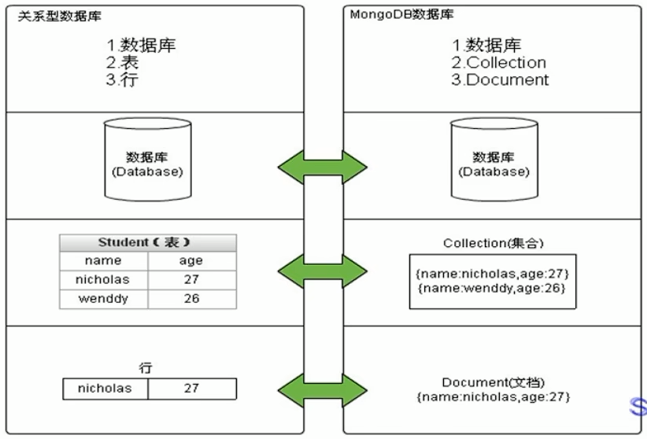

# MongoDB

[base]: ..\..\mongodb\01_MongoDB用起来-快速上手\01_讲义\mongodb_base.pdf
[advance]: ..\..\mongodb\02_MongoDB用起来-集群安全\01_讲义\mongodb_advance.pdf

## 1.基本介绍

### 简介

MongoDB是一个开源、高性能、无模式的**文档型数据库**，当初的设计就是用于简化开发和方便扩展，是NoSQL数据库产品中的一种。是最像关系型数据库（MySQL）的**非关系型数据库**。 它支持的数据结构非常松散，是一种类似于 JSON 的 格式叫BSON，所以它既可以存储比较复杂的数据类型，又相当的灵活。 

MongoDB中的记录是一个文档，它是一个由字段和值对（field:value）组成的数据结构。MongoDB文档类似于JSON对象，即一个文档认为就是一个对象。字段的数据类型是字符型，它的值除了使用基本的一些类型外，还可以包括其他文档、普通数组和文档数组。

### 体系结构

MySQL和MongoDB对比

| SQL术语/概念 | MongoDB术语/概念 |              解释/说明              |
| :----------: | :--------------: | :---------------------------------: |
|   database   |     database     |               数据库                |
|    table     |    collection    |            数据库表/集合            |
|     row      |     document     |           数据记录行/文档           |
|    column    |      field       |             数据字段/域             |
|    index     |      index       |                索引                 |
| table joins  |                  |        表连接,MongoDB不支持         |
|              |     嵌入文档     | MongoDB通过嵌入式文档来替代多表连接 |
| primary key  |   primary key    | 主键,MongoDB自动将_id字段设置为主键 |

## 2.常用命令小结

1. 选择切换数据库：use articledb 
2. 插入数据：db.comment.insert({bson数据}) 
3. 查询所有数据：db.comment.find(); 
4. 条件查询数据：db.comment.find({条件}) 
5. 查询符合条件的第一条记录：db.comment.findOne({条件}) 
6. 查询符合条件的前几条记录：db.comment.find({条件}).limit(条数) 
7. 查询符合条件的跳过的记录：db.comment.find({条件}).skip(条数) 
8. 修改数据：db.comment.update({条件},{修改后的数据}) 或db.comment.update({条件},{$set:{要修改部分的字段:数据}) 
9. 修改数据并自增某字段值：db.comment.update({条件},{$inc:{自增的字段:步进值}}) 
10. 删除数据：db.comment.remove({条件}) 
11. 统计查询：db.comment.count({条件}) 
12. 模糊查询：db.comment.find({字段名:/正则表达式/}) 
13. 条件比较运算：db.comment.find({字段名:{$gt:值}}) 
14. 包含查询：db.comment.find({字段名:{$in:[值1，值2]}})或db.comment.find({字段名:{$nin:[值1，值2]}}) 
15. 条件连接查询：db.comment.find({$and:[{条件1},{条件2}]})或db.comment.find({$or:[{条件1},{条件2}]})

## 3.索引-index

MongoDB是B-tree结构，MySQL是B+tree

## 4.面试题

1. 什么是MongoDB？
MongoDB是一种非关系型数据库，被广泛用于大型数据存储和分布式系统的构建。MongoDB支持的数据模型比传统的关系型数据库更加灵活，支持动态查询和索引，也支持BSON格式的数据存储，这种格式可以支持读取和写入大量的数据。

2. MongoDB的优势是什么？
MongoDB的优势主要包括：

灵活的数据模型：MongoDB支持动态查询和索引，可以支持更大的数据集。
分布式扩展：MongoDB可以轻松地横向扩展，支持跨多个服务器分布数据，实现高可用性和负载均衡。
大规模数据存储：MongoDB支持海量数据存储，提供非常高的性能和可扩展性。
易于使用：MongoDB提供简单的命令行工具和可视化界面，支持多种编程语言，易于使用和自定义。
3. MongoDB的工作原理是什么？
MongoDB基于JSON格式存储数据，并使用BSON格式处理数据。它支持多个数据节点的分布式存储，每个数据节点都可以独立扩展。MongoDB可以自动化控制数据的复制和故障转移。需要注意的是，MongoDB不支持跨节点的事务。

4. MongoDB的数据存储格式是什么？
MongoDB将数据存储为对应的BSON格式文件，这个文件是二进制的，可以通过MongoDB提供的命令行工具进行读取和写入。BSON是Binary JSON的缩写，是JSON的一种扩展，能够更快地将数据存储和读取到MongoDB数据库中。

5. 什么是MongoDB索引？
MongoDB索引是为一个或者多个文档字段创建的数据结构，能够帮助MongoDB更加快速地执行查询操作。索引可以被定义为唯一的，如果这样定义，MongoDB将确保所有的值都不同。MongoDB支持单边和多边索引，可以深度嵌套和数组字段的嵌套索引。

​		`使用db.collection.createIndex()在集合中创建一个索引`
6. 如何优化MongoDB查询性能？
MongoDB查询性能可以优化的方法包括：

为查询字段创建索引：在查询频繁的字段上创建索引，能够提高查询速度。
限制查询结果的数量：可以使用skip()和limit()方法分页，减少查询结果大小。
只查询需要的字段：使用projection或者特定字段查询的方式，避免查询所有字段，减少网络传输带宽。
使用聚合查询：使用聚合查询代替多个单独的查询语句，可以提高性能。
为数据结构优化设计：为了优化结构设计，尽可能减少重复的数据。
7. MongoDB的复制如何工作？
MongoDB的复制工作是基于主从复制实现的。其中一个节点被定义为主节点，使用replica set的方式，其他的节点被定义为备份节点，数据会进行实时同步。在某些情况下，主节点可能会失效或消失，这时候从节点将被提升为主节点继续工作。

8. MongoDB的副本集是什么？
MongoDB的副本集是一组备份节点，用于实现高度的可用性。副本集维护多个数据节点，其中的一个被定义为主节点，其他的节点都被定义为备份节点。如果主节点在崩溃，选择另外一个节点作为主节点。

9. 如何区分MongoDB和关系型数据库？
MongoDB相较关系型数据库有以下几个显著的不同点：

数据结构不同：MongoDB使用文档形式存储数据，而关系型数据库使用表这种结构体来存储数据。
索引不同：MongoDB支持的索引比关系型数据库更加灵活。
分布式和可扩展性强：MongoDB具有高度的可扩展性和分布式数据库的特性，能够支持海量数据存储。而关系型数据库的可扩展性较差，虽然引入到分布式系统，但是需要较多的数据库连接和配置。
10. 什么是MongoDB的聚合函数？
MongoDB的聚合函数用于对文档进行分组和汇总操作，支持对数据进行复杂计算和处理。聚合函数对于数据分析和统计非常有用，通过数据分组可以更快的获取收集数据中的关键信息。聚合函数可以支持多个匹配条件，同时也可以支持分组计算，并提供了丰富可运算算法和运算符支持。

​		`db.COLLECTION_NAME.aggregate(AGGREGATE_OPERATION)`
11. MongoDB成为最好NoSQL数据库的原因是什么?
    以下特点使得MongoDB成为最好的NoSQL数据库：

​		面向文件的
​				高性能
​				高可用性
​				易扩展性
​				丰富的查询语言

12. 在哪些场景使用MongoDB？
    大数据
    内容管理系统
    移动端Apps
    数据管理
13. MongoDB支持哪些数据类型
    String
    Integer
    Double
    Boolean
    Object
    Object ID
    Arrays
    Min/Max Keys
    Datetime
    Code
    Regular Expression等
14. 如何查询集合中的文档
    db.collectionName.find({key:value})
15. 用什么方法可以格式化输出结果
    db.collectionName.find().pretty()
16. 更新数据
    `db.collectionName.update({key:value},{$set:{newkey:newValue}})`
17. 如何删除文档
    `db.collectionName.remove({key:value})`
18. 在MongoDB中如何排序
    并使用 1 和 -1 来指定排序方式，其中 1 表示升序，而 -1 表示降序。

​		`db.connectionName.find({key:value}).sort({columnName:1})`

19. 如何理解MongoDB中的GridFS机制，MongoDB为何使用GridFS来存储文件？
GridFS是一种将大型文件存储在MongoDB中的文件规范。使用GridFS可以将大文件分隔成多个小文档存放，这样我们能够有效的保存大文档，而且解决了BSON对象有限制的问题

20. 索引类型有哪些？
单字段索引(Single Field Indexes)
复合索引(Compound Indexes)
多键索引(Multikey Indexes)
全文索引(text Indexes)
Hash 索引(Hash Indexes)
通配符索引(Wildcard Index)
2dsphere索引(2dsphere Indexes)
21. 复制集节点类型有哪些？
优先级0型(Priority 0)节点
隐藏型(Hidden)节点
延迟型(Delayed)节点
投票型(Vote)节点以及不可投票节点
22. 更新操作立刻fsync到磁盘?
不会,磁盘写操作默认是延迟执行的.写操作可能在两三秒(默认在60秒内)后到达磁盘.例如,如果一秒内数据库收到一千个对一个对象递增的操作,仅刷新磁盘一次.

23. 我怎么查看 Mongo 正在使用的链接?
`db._adminCommand("connPoolStats");`
24. MongoDB支持存储过程吗？如果支持的话，怎么用？
MongoDB支持存储过程，它是javascript写的，保存在db.system.js表中。

25.如果一个分片（Shard）停止或很慢的时候，发起一个查询会怎样？

​		如果一个分片停止了，除非查询设置了“Partial”选项，否则查询会返回一个错误。如果一个分片响应很				慢，MongoDB会等待它的响应。

26. 分片(sharding)和复制(replication)是怎样工作的?
每一个分片(shard)是一个分区数据的逻辑集合。分片可能由单一服务器或者集群组成，我们推荐为每一个分片(shard)使用集群。

27. 数据在什么时候才会扩展到多个分片(shard)里?
MongoDB 分片是基于区域(range)的。所以一个集合(collection)中的所有的对象都被存放到一个块(chunk)中。只有当存在多余一个块的时候，才会有多个分片获取数据的选项。现在，每个默认块的大小是 64Mb，所以你需要至少 64 Mb 空间才可以实施一个迁移。

28. 什么是master或primary?
它是当前备份集群(replica set)中负责处理所有写入操作的主要节点/成员。在一个备份集群中，当失效备援(failover)事件发生时，一个另外的成员会变成primary。

29. 什么是secondary或slave?
Seconday从当前的primary上复制相应的操作。它是通过跟踪复制oplog(local.oplog.rs)做到的。

30. 你怎么比较MongoDB、CouchDB及CouchBase?
MongoDB和CouchDB都是面向文档的数据库。MongoDB和CouchDB都是开源NoSQL数据库的最典型代表。 除了都以文档形式存储外它们没有其他的共同点。MongoDB和CouchDB在数据模型实现、接口、对象存储以及复制方法等方面有很多不同。
————————————————

原文链接：https://blog.csdn.net/lishangke/article/details/130108711